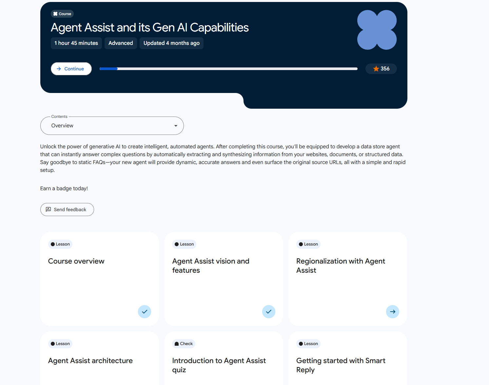

# Agent Assist Overview

> ### 🟦 Welcome to the Agent Assist and its Gen AI Capabilities course

---

## 🎯 Course Description
This course teaches contact center agents across industries how to use the **Customer Engagement Suite (CES) Agent Assist** to improve communication quality and deliver faster, higher‑quality support.

You’ll explore the **architecture** and **technical components** of CES Agent Assist and learn how to leverage its **generative AI** capabilities, including:
- **LLM Baseline Summarization** – quickly summarize conversations  
- **Generative Knowledge Assist (GKA)** – retrieve relevant knowledge instantly  
- **Sentiment Analysis** – understand customer emotion in real time

---

## 🧭 Learning Objectives
By the end of this session, you will be able to:

1. **Describe** the purpose of Agent Assist, including key features and limitations.  
2. **Summarize** the **Agent Assist architecture** and where each component fits.  
3. **Explain & configure** **Smart Reply**.  
4. **Explain** **Smart Compose**.  
5. **Describe** **LLM baseline summarization** and outline implementation steps.  
6. **Explain** **GKA** and how it integrates with Gen AI agents.  
7. **Enable & interpret** **sentiment analysis**.  
8. **Summarize** the **delivery lifecycle** for Agent Assist.

---

## 🧩 Key Concepts (Quick Reference)

- **Agent Assist**  
  Real‑time assistance for agents (suggested replies, knowledge, summaries).

- **Smart Reply**  
  Auto‑suggested responses based on conversation context.

- **Smart Compose**  
  Predictive text that helps agents complete sentences faster.

- **LLM Baseline Summarization**  
  Model‑generated recap of a conversation; used for handoffs, notes, QA.

- **Generative Knowledge Assist (GKA)**  
  Retrieves and ranks relevant knowledge articles/snippets for the agent.

- **Sentiment Analysis**  
  Detects customer sentiment trends throughout the interaction.

---

