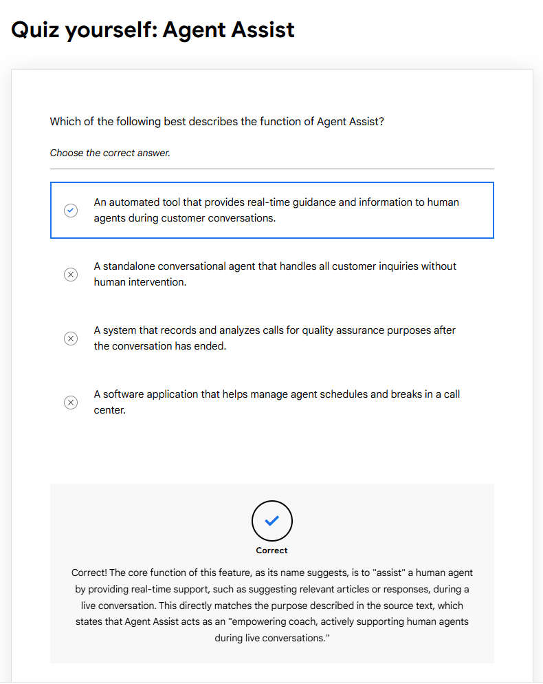

# Agent Assist Vision and Features

> ### 🟦 Module: Agent Assist Vision and Features

.*

---

## 📘 Module Introduction: Agent Assist

This module introduces **Agent Assist** and explains how its features can improve your daily tasks as a call center agent. You’ll learn about various chat capabilities — including some new and upcoming ones — and understand how regionalization impacts Agent Assist behavior and performance.

---

## 🤖 Agent Assist leverages the power of AI to empower human agents

Imagine if human call center agents had a **digital sidekick**, offering realtime assistance and guiding complex customer interactions.

**Agent Assist *is* that sidekick**, helping human agents:

- Respond faster  
- Improve accuracy  
- Reduce workload  
- Maintain consistency  
- Deliver higher‑quality customer service  

Agent Assist provides contextual, real‑time guidance that helps agents be more productive and provide better service, exactly when they need it most.

---

## 🧩 Agent Assist Features

Agent Assist provides several core features for human agents, including:

- **Smart Reply**  
- **Smart Compose**  
- **Generative Knowledge Assist (GKA)**  
- **LLM Summarization**  
- **Sentiment Analysis**

Let’s explore each capability:

---

### 💬 Smart Reply & Smart Compose

Smart Reply and Smart Compose generate **contextually accurate** and **appropriate responses** during customer conversations.

- Responses are AI‑generated based on your data  
- Helps streamline chat interactions  
- Saves precious time for both agents and customers  

---

### 📚 Generative Knowledge Assist (GKA)

GKA proactively surfaces **relevant knowledge** to support the agent in realtime.

Think of it as an **encyclopedia on demand** — always ready with the correct, up‑to‑date answer.

Benefits:

- Knowledge is always relevant  
- Instant retrieval  
- Reduces time spent searching for information  

---

### 📝 LLM Summarization

LLM Summarization provides **realtime summaries** for Voice and Chat.

This module focuses on Chat summarization.

Key points:

- Summaries can be customized  
- Agents can tailor summaries to different tones and styles  
- Ensures accurate, concise recaps of interaction history  
- Enhances agent effectiveness & customer experience  

---

### 😊 Sentiment Analysis

Sentiment Analysis helps agents understand interactions at a **deeper emotional level**.

Details:

- Represented by **score** and **magnitude**  
- Score ranges from **–1 (negative)** to **+1 (positive)**  
- Magnitude shows overall emotional strength  
- Useful for identifying at‑risk interactions or escalations  

---

## 🆕 Upcoming Features

Google is also preparing next‑generation Gen AI features:

- **Custom LLM Summarization**  
  Takes summarization to the next level with more advanced models.

- **Proactive GKA**  
  Uses Gen AI to surface not just relevant, but *anticipated* knowledge.

- **LLM Live Translation**  
  Realtime multilingual communication.

- **AI Coach & Build‑Your‑Own Assist**  
  Advanced tools to customize guidance and training for agents.

---

## 📝 Quick Summary (TL;DR)

- Agent Assist enhances agent productivity with realtime AI support  
- Smart Reply & Compose → help agents respond faster  
- GKA → retrieves knowledge instantly  
- Summaries → capture conversation context  
- Sentiment → measures customer emotion  
- New features → translation, advanced summarization, AI coaching  

---

## 🧪 Quiz Yourself: Agent Assist

**Which of the following best describes the function of Agent Assist?**

✔ **Correct Answer:**  
**An automated tool that provides real‑time guidance and information to human agents during customer conversations.**

### ❌ Why not the others?

- ❌ *A standalone conversational agent* → that’s a chatbot, not Agent Assist  
- ❌ *A call recording QA system* → that’s post‑interaction analytics  
- ❌ *A schedule/break manager* → that’s WFM software  

---

## 📥 Screenshot Guide
