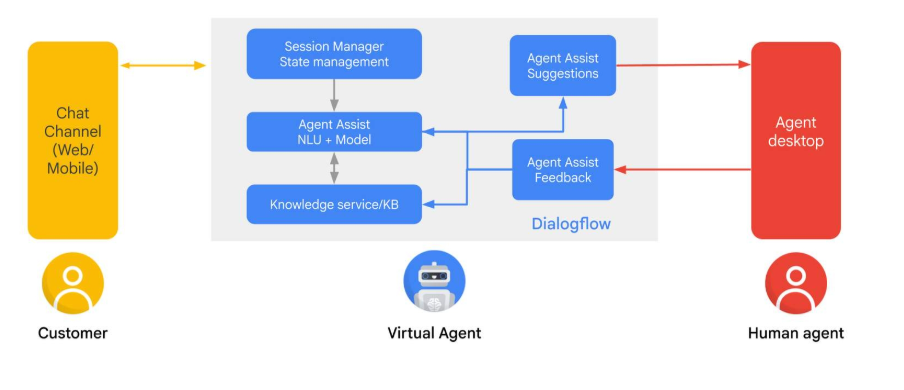

# Agent Assist architecture

## Objectives
To understand the Agent Assist architecture, imagine a customer chat being seamlessly transferred from a Conversational Agent to a Human Agent, with all the context intact.

---

## 🧭 End‑to‑End Flow (What Happens)

### 1) **Customer → Chat Client**
Customer connects via web chat, app, or third‑party channel. The **Conversational Agent** greets them and starts the interaction.

### 2) **Conversational Agent → Conversation Occurs**
The customer engages with the **virtual agent**. If the conversation needs escalation (e.g., complexity, policy, or customer request), a **handoff to a human agent** is initiated.

### 3) **Conversational Agent → Conversation Data is Forked**
At handoff, the conversation stream **branches**:  
- one branch goes to **Agent Assist NLU** (for intent/knowledge matching),  
- another goes to the **human agent desktop**.  
Agent Assist maps the conversation to relevant **FAQ/knowledge articles** and prepares **suggestions** via API.

### 4) **Human Agent → Suggestions Received**
On the agent desktop, the human can view the transcript for context. As the chat continues, **Agent Assist provides ongoing suggestions** (Smart Reply/Compose, knowledge, summaries), and agents can give feedback to improve the model.

---

## 🧪 Quiz: Agent Assist architecture (Choose 2)

**Question**  
*In a system that uses Agent Assist, what is the typical process for handling incoming customer requests?*

### ✅ Correct answers
- **An incoming request starts with a virtual agent and, if necessary, is seamlessly transferred to a human agent with full context.**  
- **An incoming request switches between the virtual agent and human agent multiple times during a single interaction.**

### ❌ Not typical
- *An incoming request is either sent to a virtual agent or a human agent, but not both within the same interaction.*  
- *An incoming request bypasses the virtual agent entirely and is always directed to a human agent.*

---

## ⚡ Quick Summary (TL;DR)

- **Start virtual → handoff human** with **full context**.  
- At handoff, **conversation data forks** to Agent Assist (NLU/knowledge) and the **agent desktop**.  
- **Agent Assist augments** the human in real time (Smart Reply/Compose, knowledge, summaries).  
- The quiz expects both: **virtual‑first handoff** **and** the possibility of **switching** during one interaction.
``

