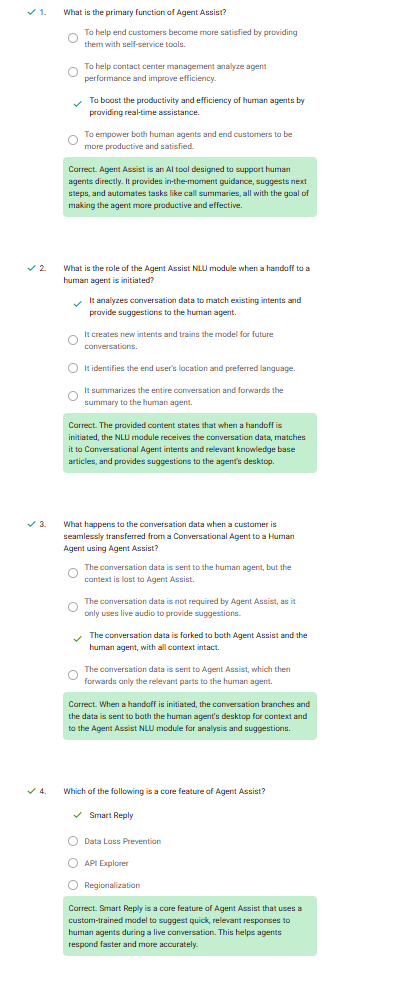

# Agent Assist Quiz – Questions & Answers

## 1. What is the primary function of Agent Assist?
**Answer:** To boost the productivity and efficiency of human agents by providing real-time assistance.

---

## 2. What is the role of the Agent Assist NLU module when a handoff to a human agent is initiated?
**Answer:** It analyzes conversation data to match existing intents and provide suggestions to the human agent.

---

## 3. What happens to the conversation data when a customer is seamlessly transferred from a Conversational Agent to a Human Agent using Agent Assist?
**Answer:** The conversation data is forked to both Agent Assist and the human agent, with all context intact.

---

## 4. Which of the following is a core feature of Agent Assist?
**Answer:** Smart Reply

---

## Quiz minimum Passing score: 80%
<!-- Save image to ../screenshots/05-05-intent-detection.png then link below -->

