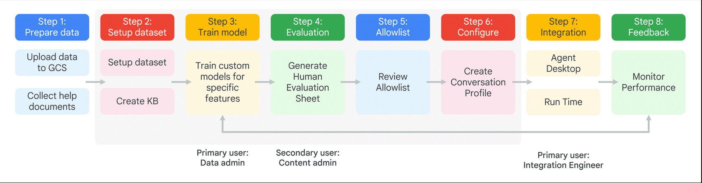

## 🏗️ Understanding the Smart Reply Architecture
Smart Reply’s architecture represents a complete **data‑to‑intelligence pipeline**, transforming raw conversational data into real‑time response suggestions for agents. This architecture is essential for anyone who wants to:
- Optimize Smart Reply performance
- Implement Smart Reply in a production environment
- Understand how AI assistance turns conversation logs into actionable suggestions

It covers the entire lifecycle—from **data preparation → model training → evaluation → allowlist → deployment → monitoring**.

---

## 🔄 End‑to‑End Workflow (8 Key Stages)

### 🔵 **Step 1 — Prepare Data**
- Upload conversation data to GCS
- Collect help documents (optional knowledge sources)
- *Primary user:* Data Admin

### 🟠 **Step 2 — Setup Dataset**
- Create the Knowledge Base (KB)
- Configure dataset structure

### 🟡 **Step 3 — Train Model**
- Train custom Smart Reply models
- Optimize based on conversation patterns
- *Output:* Candidate model for evaluation

### 🟢 **Step 4 — Evaluate Model**
- Generate a **Human Evaluation Sheet**
- Compare model responses with human‑approved references
- *Secondary user:* Content Admin

### 🟣 **Step 5 — Allowlist Review**
- Review suggested responses
- Approve or refine the allowlist
- Ensures safe & quality‑controlled responses

### 🔴 **Step 6 — Configure Conversation Profile**
- Create + configure a Conversation Profile for Smart Reply
- Link model, allowlist, settings, triggers

### 🟧 **Step 7 — Integration (Agent Desktop)**
- Integration engineer connects Smart Reply to the agent UI
- Run time configuration begins

### 🟩 **Step 8 — Feedback & Monitoring**
- Monitor model performance
- Gather feedback to continuously improve Smart Reply

---

## 🌐 Architecture Flow Summary
The architecture ensures Smart Reply is:
- **Continuously learning** from updated data
- **Adapting** to new examples and agent feedback
- **Delivering accurate suggestions** to help agents handle cases faster
- **Improving customer experience** by providing consistent, high‑quality replies

It is designed for reliability, scalability, and real‑time performance.

---

## 🟦 Quick Summary (Bullet Points)
- Smart Reply uses an **8‑step architecture** from data prep → monitoring.
- Includes model training, allowlist approval, configuration, and integration.
- Primary users involved: **Data Admin**, **Content Admin**, **Integration Engineer**.
- Output is real‑time, high‑quality suggestions for agents.
- Continuous feedback ensures ongoing improvement.

---

## Screenshot (optional)

