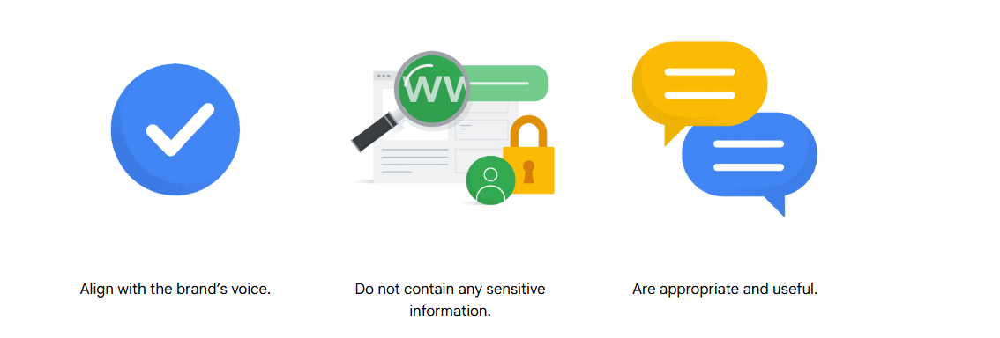
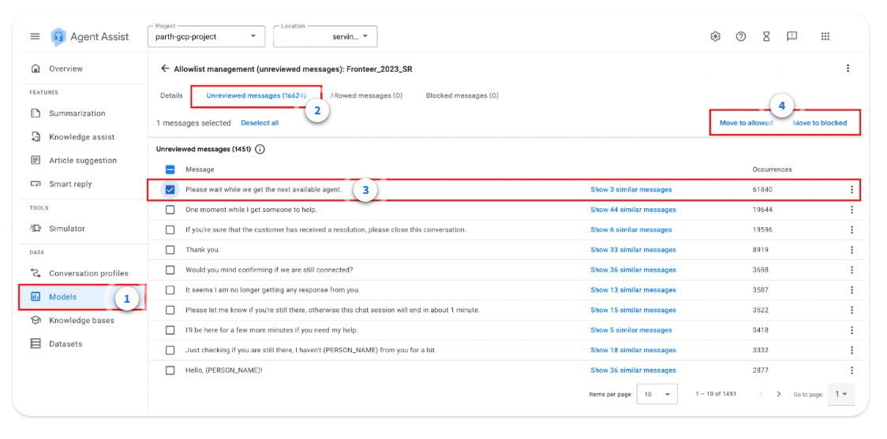

# ✅ Smart Reply — **Allowlists & Moderation**

---

## 🏷️ What is an **Allowlist**?
During model training, Smart Reply automatically produces an **Allowlist** — a curated set of frequently observed candidate replies from your chat logs. This list is **unreviewed initially**, so its quality mirrors the integrity of your dataset. Human review ensures that suggestions:

- 🔊 **Align** with your brand voice and tone
- 🛡️ **Exclude sensitive info** (PII, secrets, internal data)
- 🎯 Are **appropriate, safe, and useful** in production

> Each Smart Reply model is backed by an Allowlist of **up to ~50,000 candidate messages**.

---

## 🧭 Candidate Message **States**
Every candidate in the Allowlist lives in **one of three states**:

- **Unreviewed** — waiting for human moderation (default after training)
- **Allowed** — approved and eligible for live Smart Reply suggestions
- **Blocked** — explicitly disallowed and will **not** be suggested

> Moderation is continuous. As the dataset and usage evolve, move messages between **Allowed** and **Blocked** to keep suggestions on‑brand and safe.

---

## 🛠️ Modify Messages **After Review** (Policy Examples)
Use your business rules to **edit or block** candidates that are risky or low‑quality, for example:

- Text with **REDACTED** placeholders (e.g., numbers, names like “my name is ***”, days like “Happy Monday”)
- **Patterned text** introduced by anonymization (e.g., `XXXX`, `NNNN`)
- **Grammatical errors** or unclear phrasing
- Anything that **violates business policies** → *block it*

---

## 🚦 Common Issues with **Blocked** Candidates
- The system continuously groups **similar messages** (e.g., “Thank you” vs “Thank you so much”) to avoid redundancy.
- **Propagation delay:** moving a message/group to *Blocked* can take **5–30 minutes** to fully update. You might briefly still see them suggested while changes propagate.

---

## 🔁 Change the **State** of a Message
> *You will add the screenshot; paragraph below is prepared for your image.*

To update message states in the console, open **Models → Unreviewed messages**, select one or more items, then choose **Move to allowed** or **Move to blocked**. A message cannot return to *Unreviewed* once moderated, but you can **toggle freely between Allowed and Blocked** later. This lets you quickly clamp down on newly risky phrases or re‑enable responses after policy changes.

## ✏️ Update a Message 

> Example: After selecting a row, click **Edit** to tweak grammar or brand tone, then save and keep it **Allowed** — or flip it to **Blocked** if it fails policy.

---

## 🧪 Quiz — *Allowlists*
**Q1.** *How can you prevent potential Smart Reply suggestions from a model from being shown to agents during a conversation?*

**Choices:**
1) Delete the suggestion from the training dataset.  
2) **Move the suggestion to the `Blocked` list in the allowlist.**  
3) Do not set the suggestion to `Allowed` in the allowlist.  
4) `Unreviewed` suggestions, along with `Allowed` suggestions, are eligible to be shown to agents.

**✅ Correct Answer:** **(2) Move the suggestion to the `Blocked` list in the allowlist.**  
**Why:** Deleting from training data would require **retraining** and doesn’t guarantee immediate suppression; only **Blocked** guarantees the model won’t suggest it.

---

## 🟦 Quick Summary
- The **Allowlist** is the moderated inventory of candidate replies (up to **~50k** entries).
- Candidate states: **Unreviewed → Allowed / Blocked**; only **Blocked** ensures *no suggestion*.
- **Edit** or **block** messages with placeholders, anonymization patterns, grammar issues, or policy violations.
- Similar messages are **grouped**; **5–30 min** propagation can occur after blocking.
- In console: **Models → Unreviewed → select → Move to allowed/blocked**; later you can toggle **Allowed** ↔ **Blocked** as policies evolve.

---
