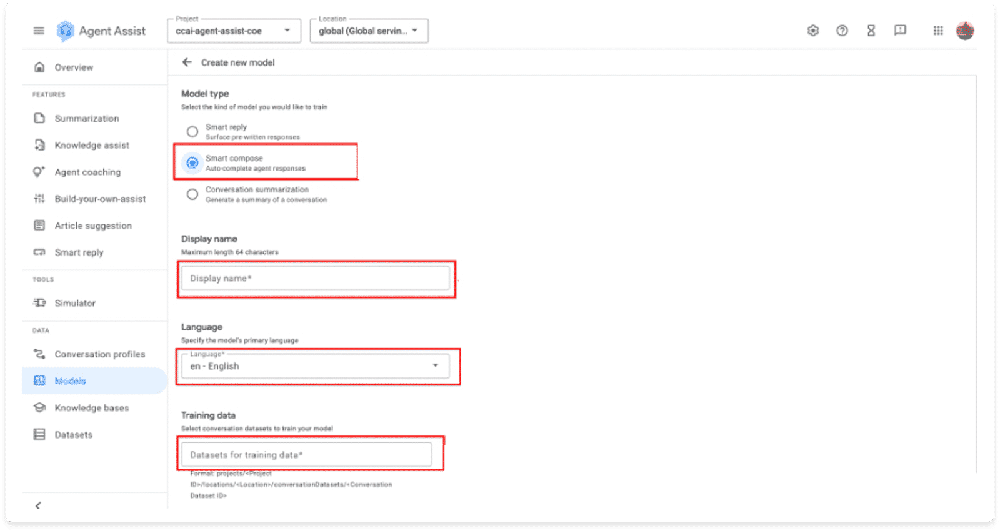

# ✨ Smart Compose — Premium Notes

---

## 🧠 What is **Smart Compose**?
Smart Compose is a companion feature to Smart Reply that helps agents **autocomplete the next word or phrase** during live conversations.

Unlike Smart Reply:
- Smart Reply suggests **full sentence responses**.
- **Smart Compose completes partial sentences**, offering the next likely words.

This makes Smart Compose ideal for:
- Fast typing assistance
- Maintaining consistent tone and style
- Reducing agent fatigue during long chat sessions

---

## 🏋️ Smart Compose Training
Training Smart Compose follows **the same pipeline** as Smart Reply:
- Prerequisites
- Dataset preparation
- Data ingestion into GCS
- Dataset creation

The only difference:
> When training the model, **select Smart Compose** instead of Smart Reply.

All other steps—evaluation, allowlists, and integration—follow Smart Reply’s standards.

---

## 📌 Example Architecture Diagram *(placeholder)*

---

## 🟦 Quick Summary
- **Smart Compose autocompletes words/phrases**, unlike Smart Reply which offers full sentences.
- Training Smart Compose uses the **same data pipeline** as Smart Reply.
- During model creation, simply **choose Smart Compose** as the model type.
- Great for productivity, typing speed, and consistent brand tone.

---
