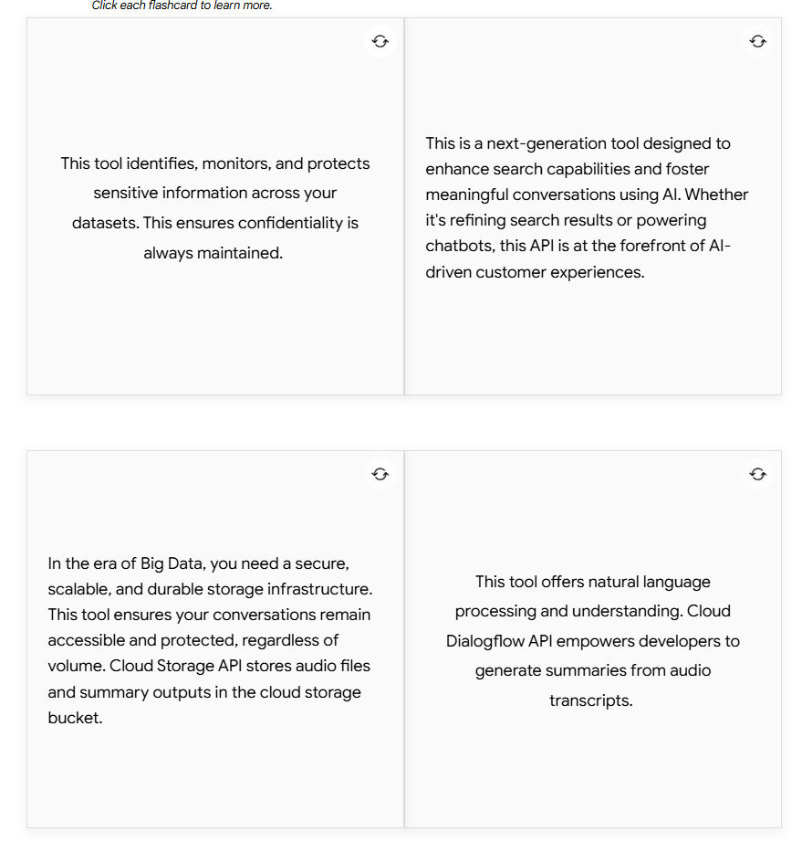
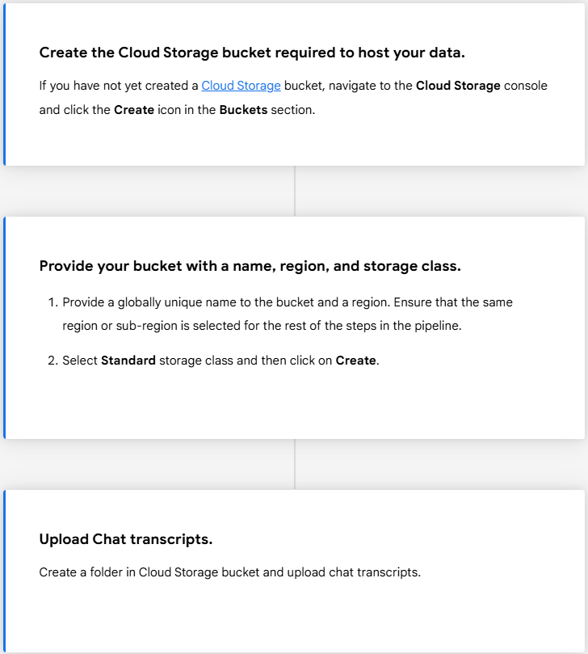
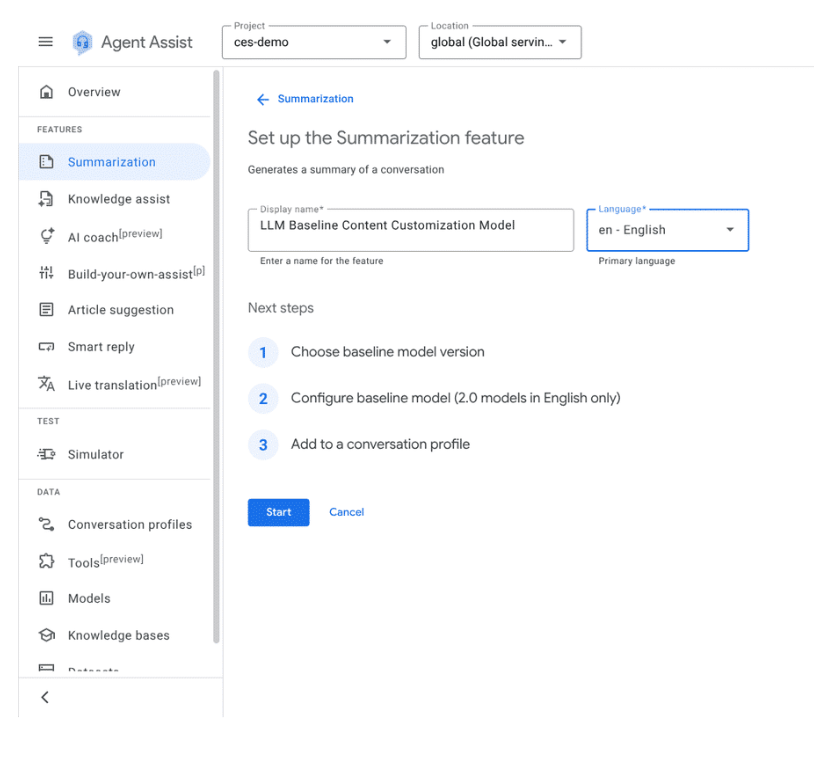

# 🧩 LLM Summarization Implementation — Premium Notes

---

## 🔌 API Service Enablement
To implement **LLM Baseline Summarization**, enable these services in your GCP project:

- **Cloud Data Loss Prevention (DLP) API** — identify, monitor, and protect sensitive information across datasets.
- **Vertex AI Search and Conversation API** — next‑gen conversational/search foundation used by Agent Assist experiences.
- **Cloud Storage API** — secure, scalable storage for transcripts and summary outputs.
- **Cloud Dialogflow API** — NLU plumbing for orchestration and (optionally) audio transcript workflows.

---

## 📥 Data Ingestion (High‑level Flow)
1. **Create a Cloud Storage bucket** to host training/eval data.
2. **Choose name, region, and storage class** (usually `Standard`) and create the bucket.
3. **Upload chat transcripts** to a folder in the bucket (follow your agreed JSON/CSV schema).

---

## 🗂️ Create a Conversation Profile (for Summarization)
In **Agent Assist Console → Summarization**:
1) Click **Start** and select the **Baseline model version**.  
2) Configure sections relevant to your use case: *Situation, Action, Resolution, Customer Satisfaction, Reason for Cancellation, Entities*.  
3) **Add to a Conversation Profile** (or create a new one) to activate summarization in simulations or live traffic.

---

## 🧪 Mini‑Quiz: LLM Summarization Implementation
**Q1. Which API helps you detect and redact sensitive data during the pipeline?**  
**✅ Answer:** *Cloud Data Loss Prevention (DLP) API.*

**Q2. Where should you upload chat transcripts for the pipeline?**  
**✅ Answer:** *Google Cloud Storage (GCS) bucket created in your project.*

**Q3. Which step activates summarization suggestions for agents or the simulator?**  
**✅ Answer:** *Adding the configured model to a **Conversation Profile**.*

---

## 📚 Additional Resources
- Cloud DLP product page — data classification & protection  
  <https://cloud.google.com/security/products/dlp>
- Vertex AI **Agent Builder** (Search & Conversation)  
  <https://cloud.google.com/products/agent-builder>
- Cloud Storage **IAM permissions** reference  
  <https://cloud.google.com/storage/docs/access-control/iam-permissions>
- Dialogflow ES quick setup  
  <https://cloud.google.com/dialogflow/es/docs/quick/setup>
- Python client library for **Cloud Storage**  
  <https://cloud.google.com/python/docs/reference/storage/latest>

---

## 🟦 Quick Summary
- Enable **DLP, Vertex AI Search & Conversation, Cloud Storage, Dialogflow** APIs.  
- Ingest transcripts into **GCS** (proper schema/region).  
- Configure **summary sections** and attach the model to a **Conversation Profile**.  
- Use the links above for security, orchestration, IAM, setup, and SDK references.

---
