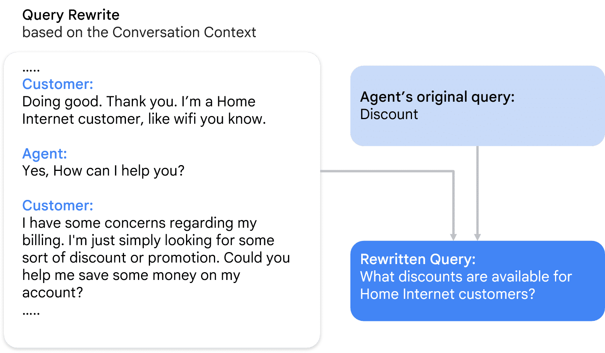

# 🧩 Session: Generative Knowledge Assist — Best Practices

## 📌 1. Content Quality
The quality of the content is the **backbone of any knowledge document**. Not all content adds value—especially when the goal is to support agents quickly and effectively.

### 🔍 What to Remove
Irrelevant or distracting elements should be excluded, especially from the **opening section** of your documents. These include:
- Navigation bars
- Last‑modified timestamps
- Feedback or rating forms
- Any UI noise not related to the core subject

### ⭐ Best Practice
Always begin with **high‑value, actionable information** that immediately helps agents.

---

## 📌 2. Article Suggestion
The Article Suggestion tool displays the **first few sentences** of a document to agents as a snippet. This snippet should:
- Provide immediate clarity
- Summarize what the article covers
- Contain **no irrelevant introduction**

### ⭐ Best Practice
Start your document with content that directly supports problem‑solving.

---

## 📌 3. Format Optimization
Support tools process **text**. Therefore, content format impacts performance and usability.

### ❌ Avoid
- Image‑only documents
- Audio‑only documents
- Video‑only documents

### ⚠ Long Documents
If a document exceeds **1000+ words**, break it into smaller, focused documents.

---

## 📌 4. Document Usefulness
A strong knowledge base focuses on **relevant, frequently used** documents.

### ⭐ Include
- High‑value, frequently accessed documents
- Updated and accurate guides

### ❌ Exclude
- Outdated documents
- Rarely accessed documents
- Inactive or obsolete content

---

# 📝 Summary
To optimize Generative Knowledge Assist (GKA):
- Keep content **high‑quality and relevant**
- Ensure the first lines act as **effective agent‑support snippets**
- Use text‑based, well‑structured formatting
- Maintain a curated, useful knowledge base

---

## 📚 Additional Resources
For more information, refer to:
- [FAQ Assist](https://docs.cloud.google.com/agent-assist/docs/faq)
- [Generative Knowledge Assist](https://docs.cloud.google.com/agent-assist/docs/generative-knowledge-assist)
- [Creating a Knowledge Base](https://docs.cloud.google.com/agent-assist/docs/knowledge-base)
