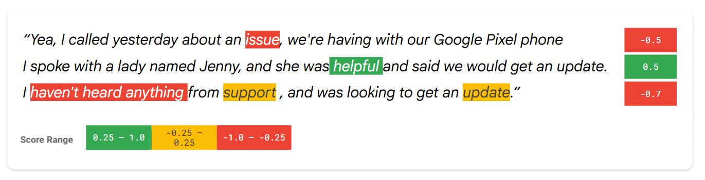

# ❤️‍🩹 Sentiment Analysis — Agent Assist (Premium MD Session)

## 🧠 What is the purpose of Sentiment Analysis?
Sentiment Analysis helps determine the **emotional intent** expressed during a conversation between a Human Agent and an end‑user. It highlights emotional indicators within text so agents can better understand customer mood, frustrations, or positive engagement.

This feature analyzes text using two key metrics:

### ⭐ Score
A value between **–1.0 (negative)** and **1.0 (positive)** representing the overall emotional leaning.

### ⭐ Magnitude
A value from **0.0 to positive infinity**, indicating **emotional intensity** regardless of sentiment direction.

---

## 📊 Example
Sentiment‑related emotions highlighted:
- “issue” → negative
- “helpful” → positive
- “I haven't heard anything” → negative
- “update” → neutral/positive context depending on phrasing

These values help agents quickly interpret customer sentiment and respond more effectively.

---

## ⚙️ Enabling Sentiment Analysis
You can enable Sentiment Analysis when creating or editing a **Conversation Profile**.

### Steps:
- Set **Enable Sentiment Analysis** = `true` inside **Message Analysis Configuration**.
- Send a **Create Conversation** request using a Conversation Profile with the feature enabled.
- Sentiment results will automatically be returned as part of responses.
- If **Cloud Pub/Sub** is integrated, sentiment results will also appear in the **New Message Payload**.

---

## ▶️ Official Documentation
For detailed reference, visit the official documentation:
📘 **Sentiment Analysis — Agent Assist**  
https://docs.cloud.google.com/agent-assist/docs/sentiment-analysis

---

## 📚 Additional Resources
- **Sentiment analysis for chat data documentation**  
  https://docs.cloud.google.com/agent-assist/docs/sentiment-analysis

---
