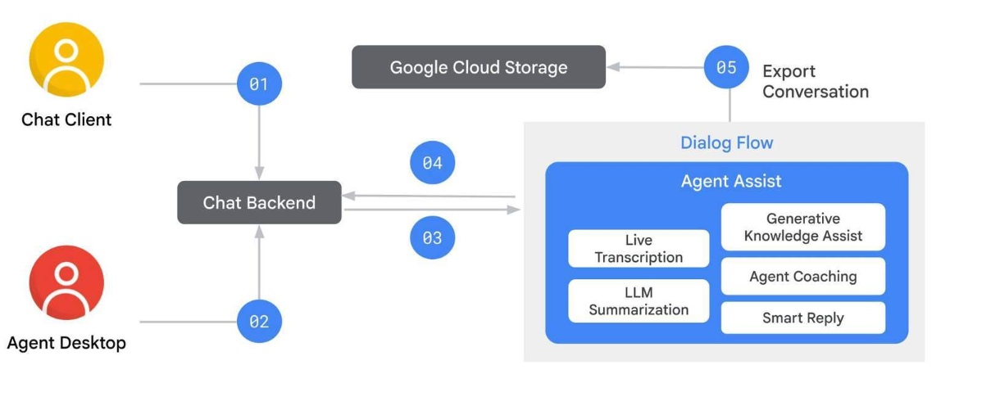

# 🌐 Design Phase

## 🧩 The Design Phase & Agent Assist Architecture
During the design phase, you establish the foundation for an AI‑powered assistance system by analyzing conversations and enabling real‑time suggestions.

---

## 🧭 Typical Scenario Overview

### 👤 The Customer
Interacts through a **chat client** — web-based or 3rd‑party messaging.

### 🧑‍💼 The Agent
Uses an **Agent Desktop Client** to manage customer interactions.

➡️ Both connect through a **chat backend** ensuring smooth real‑time communication.

---

## ⚙️ Agent Assist in Action

### 1. Customer Initiates (01)
A message is sent from the chat client → routed to the chat backend.

### 2. Agent Responds (02)
An agent replies via the Agent Desktop → message flows through the backend.

### 3. Real‑Time Analysis (03)
Agent Assist analyzes every message using the **analyzeContent API**.

**Core capabilities:**
- 📝 Live Transcription
- 🧾 LLM Summarization
- 📚 Generative Knowledge Assist
- 🎯 Agent Coaching
- ⚡ Smart Reply

---

## 🗺️ Architecture Flow Diagram

---

## 💡 4. Suggestions to Agent (04)
Agent Assist generates intelligent suggestions → delivered to Agent Desktop.

---

## 📦 5. Conversation Export (05)
Conversation data can be exported to Cloud Storage for QA, training, or analytics.

---

## ⭐ Quick Summary
- Customer & agent communicate through a chat backend.
- Agent Assist performs real‑time analysis.
- Suggestions & smart replies boost agent efficiency.
- Full conversation logs can be exported.
