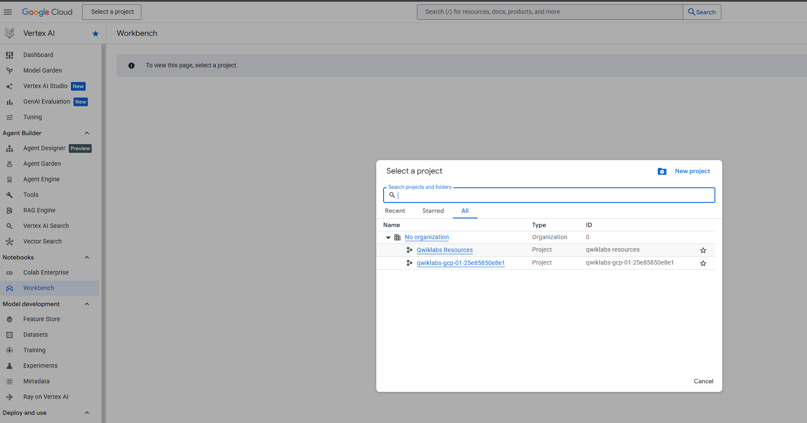
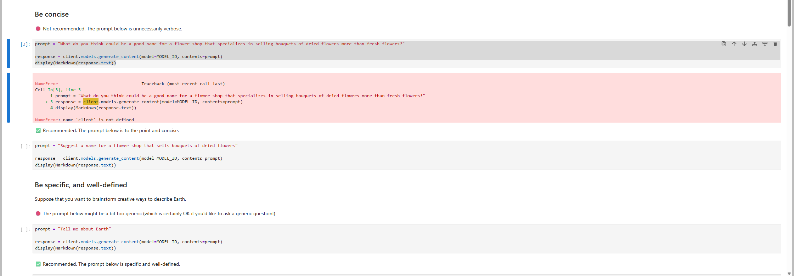
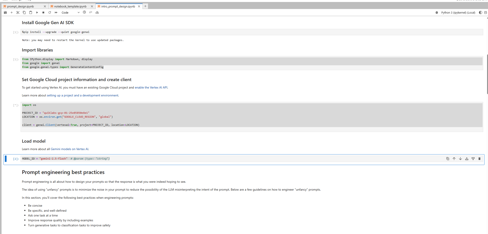
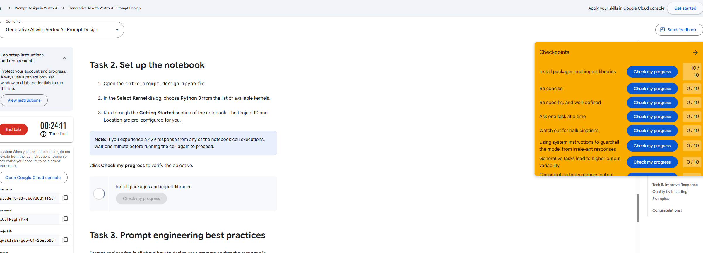
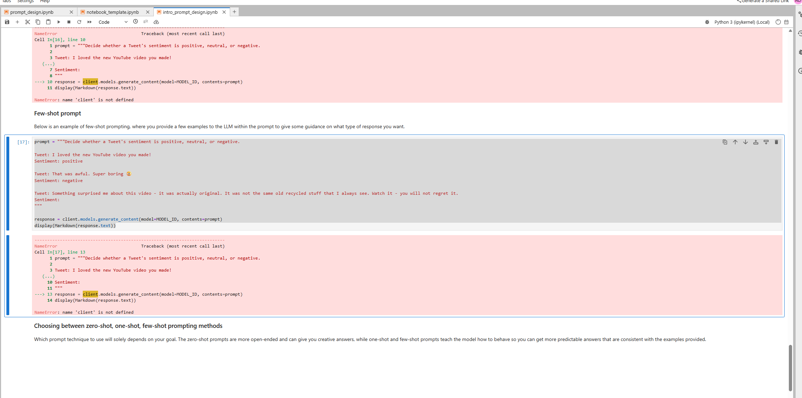

# Session 01 — Generative AI with Vertex AI: Prompt Design (GSP1151)

> **Timebox:** 45 minutes • **Level:** Introductory • **Mode:** Self‑paced Lab

## ✅ What you need to do in this session (high level)
1. **Start the lab** to receive temporary GCP credentials (Incognito window recommended).
2. Open **Vertex AI Workbench** → launch the provided **JupyterLab** instance.
3. In the notebook:
   - Install packages & import libraries (**Task 2**).
   - Work through **prompt engineering best practices** (**Task 3**):
     - Be concise
     - Be specific & well‑defined
     - Ask one task at a time
     - Watch out for hallucinations
   - **Reduce output variability** with system instructions & classification framing (**Task 4**).
   - **Improve response quality** with few‑shot examples (**Task 5**).
4. Use **Check my progress** after each sub‑task.
5. Take screenshots for evidence and save them to `../screenshots/01-*`.

---

## 🎯 Objectives
- Get started with prompt engineering using the **Google Generative AI SDK**.
- Apply best practices for prompt design: **conciseness, specificity, single‑tasking, guardrails**.
- Explore text‑generation use cases: **ideation, question answering, classification, extraction, summarization**.

---

## 🧰 Prerequisites
- Basic Python
- General API concepts
- Ability to run notebooks in **Vertex AI Workbench**

> Tip: Always use the **student credentials** from the lab (do **not** use your personal GCP account).

---

## 🪜 Step‑by‑Step

### 0) Setup & Sign‑in
- Click **Start Lab** → copy **Username** & **Password** → open Google Cloud Console in **Incognito** → sign in.
- Accept terms; do **not** enable 2FA, recovery email, or free trial.

### 1) Open Vertex AI Workbench
- Console → **Vertex AI** → **Workbench** → find the instance → **Open JupyterLab**.

### 2) Set up the notebook (Task 2)
- Open the lab notebook file.
- Kernel: **Python 3**.
- Run the **Getting Started** section to install packages and import libraries.
- Click **Check my progress** (Install packages & import libraries).

### 3) Prompt engineering best practices (Task 3)
Run the notebook cells for each sub‑section and verify:
- **Be concise** → keep instructions short & unambiguous.
- **Be specific, well‑defined** → include role, audience, constraints, output format.
- **Ask one task at a time** → split tasks; avoid compound asks.
- **Watch out for hallucinations** → add scope, cite sources, instruct to say "don’t know" when missing info.

> Click **Check my progress** after each sub‑section.

### 4) Reduce output variability (Task 4)
- Use **system instructions** to guardrail irrelevant responses.
- Reframe generative tasks as **classification** when appropriate to tighten outputs.
- Validate with **Check my progress**.

### 5) Improve response quality with examples (Task 5)
- Add **few‑shot examples** representative of your real scenarios.
- Keep examples balanced & minimal (2–5 usually enough); avoid leaking private data.
- Validate with **Check my progress**.

---

## 📝 Artifacts to capture (save to `../screenshots/`)
- `01-lab-start.png` — Lab timer & Start Lab page.

- `01-workbench.png` — Workbench / JupyterLab opened.

- `01-task2-installed.png` — successful package install.

- `01-task3-best-practices.png` — notebook cell outputs.

- `01-task5-fewshot.png` — few‑shot example and improved output.

---

## 🔍 Quality checklist before finishing
- [ ] All **Check my progress** buttons show **completed**.
- [ ] You tested at least one **system instruction** that blocks irrelevant answers.
- [ ] You added **2–3 few‑shot examples** and observed quality gains.
- [ ] Screenshots saved with correct relative links.
