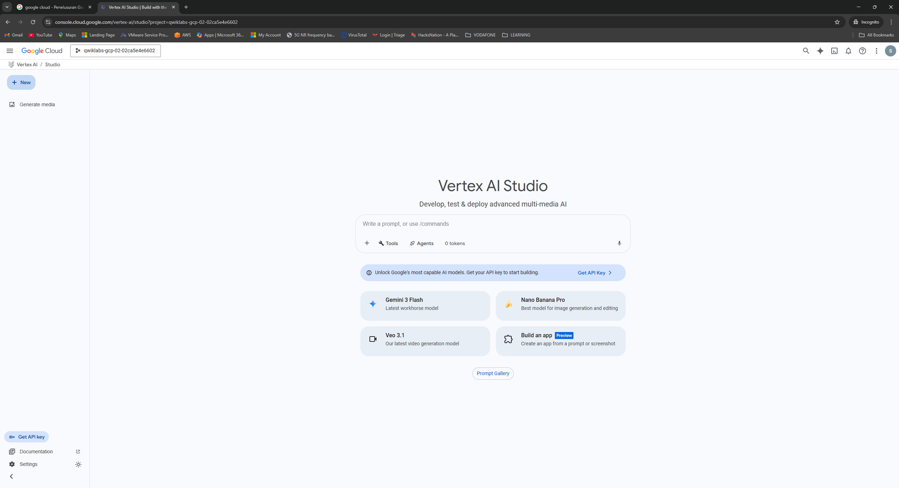
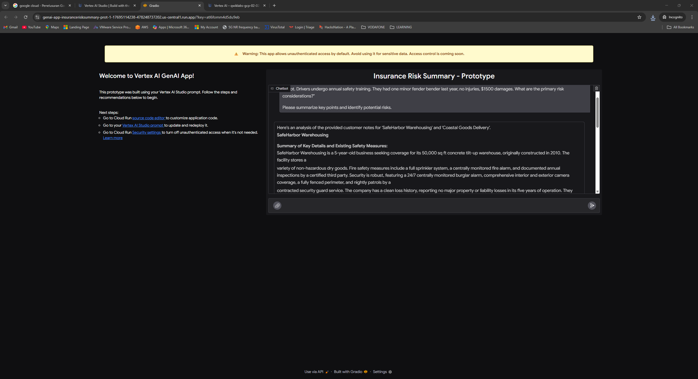
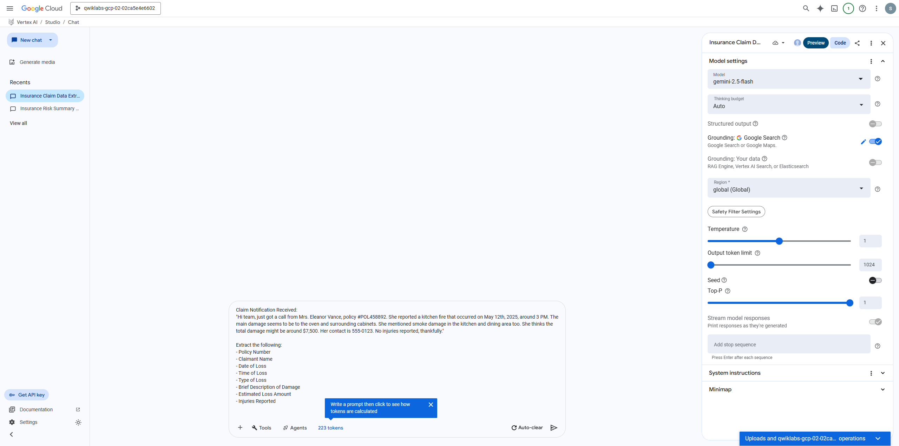
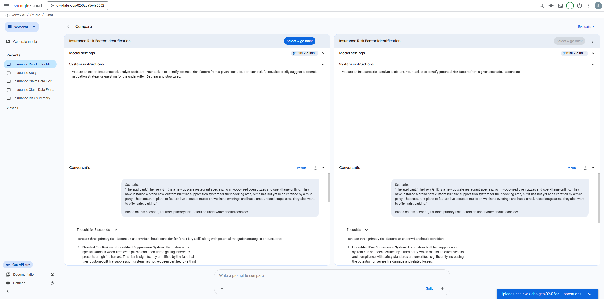
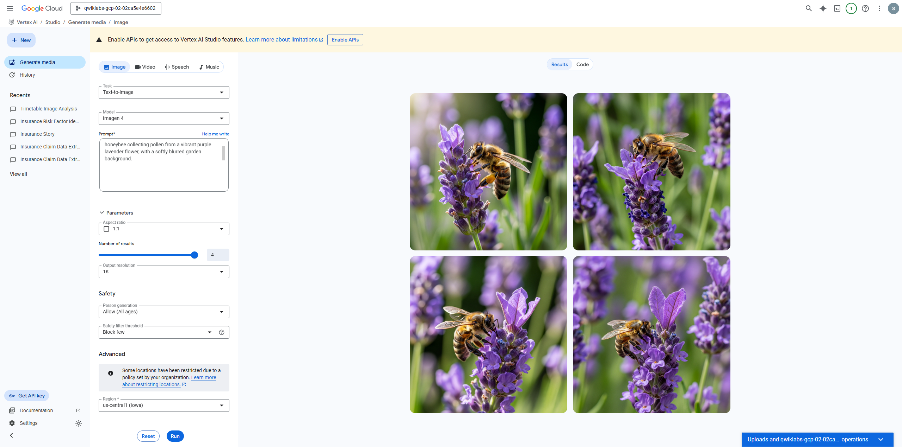

# Session 02 — Get Started with Vertex AI Studio (GSP1154)

> **Timebox:** 60 minutes • **Level:** Introductory • **Mode:** Self‑paced Lab  
> **Lab:** Prompt Design in Vertex AI – *Get Started with Vertex AI Studio*

---

## 📝 Overview

In this session, you explore **Vertex AI Studio**, Google Cloud’s browser‑based environment for designing and testing generative AI prompts using Gemini models.

You will:
- Create applications directly from prompts  
- Design effective, structured prompts  
- Compare and refine prompt versions  
- Explore multimodal prompting using image inputs  

This session uses **no Python** — all workflows happen entirely in the console.

---

## 🎯 Objectives

After completing this lab, you will be able to:

- Create a **prompt‑based application** inside Vertex AI Studio  
- Apply **prompt engineering best practices** (concise, specific, structured)  
- Use **instruction layers** and **versions** to refine prompt behavior  
- Perform **multimodal reasoning** (text + image)  
- Compare generative outputs using “Compare” mode  

---

## 🧰 Setup & Requirements

Before starting the lab:

- Use a **Chrome Incognito** window  
- Sign in with your **Qwiklabs temporary credentials**  
- Do **not** enable:
  - 2‑factor authentication  
  - Recovery email  
  - Free trial  

After clicking **Start Lab**, log in → accept terms → continue to the console.

📸 Screenshot:  

---

# 🚀 Step-by-Step

---

## 1) Open Vertex AI Studio

From the Cloud Console → Left Menu → **Vertex AI** → **Vertex AI Studio**

You’ll see the main interface with options like New Prompt, Prompt Gallery, Gemini models, and multimodal tools.

📸  

---

## 2) Create Application from a Prompt

- Click **Create Application**  
- Paste your initial instruction prompt  
- Run the model  
- Save the generated flow as a small web app  
- Open the deployed app to test your prompt end-to-end

📸  

---

## 3) Design Effective Prompts (Zero‑shot → Improved)

You now experiment with **prompt quality improvements**, such as:

- Being **concise**  
- Being **specific & well‑defined**  
- Including **output structure**  
- Clearly specifying **role + task + constraints**  

Run the prompt and observe improvements.

📸  

---

## 4) Engineer & Manage Prompts (Compare Mode)

Use **Compare** mode to evaluate multiple prompt versions side by side.

You will:
- Add an **Instruction layer**  
- Create **Prompt Version 1 & Version 2**  
- Compare outputs  
- Note how structure and constraints affect consistency  

📸  

---

## 5) Use Multimodal Prompts (Text + Image)

Upload an image and combine it with a text instruction.  
Examples:
- “Describe what is happening in this image.”  
- “Classify the scene.”  
- “Extract safety risks from this warehouse photo.”  

📸  

---

# ✔️ Quality Checklist

- [ ] Created an app from a prompt  
- [ ] Designed improved prompts (concise, specific, structured)  
- [ ] Used Compare Mode  
- [ ] Created at least 1 Instruction Layer  
- [ ] Completed a multimodal prompt  
- [ ] All Qwiklabs checkpoints marked **Complete**  
- [ ] Screenshots saved under `../screenshots/02-*`  

---

# 📝 Session Summary

In this session, you learned how to use **Vertex AI Studio** to prototype and refine generative AI workflows without writing code.

You explored:

### 🔹 Application Creation  
Creating a working generative app directly from a prompt.

### 🔹 Prompt Design  
Applying best practices—conciseness, specificity, structured outputs—to improve reliability.

### 🔹 Prompt Engineering  
Using instruction layers, versioning, and Compare mode to evaluate different prompt strategies.

### 🔹 Multimodal Reasoning  
Combining images and text to leverage Gemini’s vision capabilities.

These skills form the foundation for more advanced topics including Vertex AI Workbench, embeddings, RAG pipelines, and model tuning.

---

## 📝 Session Summary
This session covers the fundamentals of Vertex AI Studio — creating prompt‑based applications, refining prompts, using prompt management tools, and testing multimodal inputs.

---

## 📎 Reference Files

- [📄 Insurance Risk Summary.ipynb](../ref/Insurance_Risk_Summary_Prototype_Jan_27,_2026,_6_01_58 PM.ipynb)
- [📄 speech.wav](../ref/speech.wav)
``