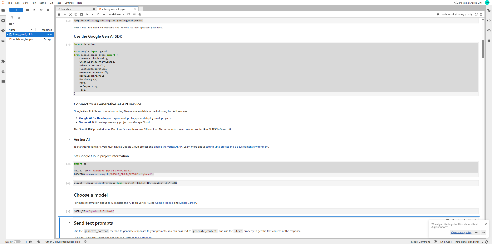
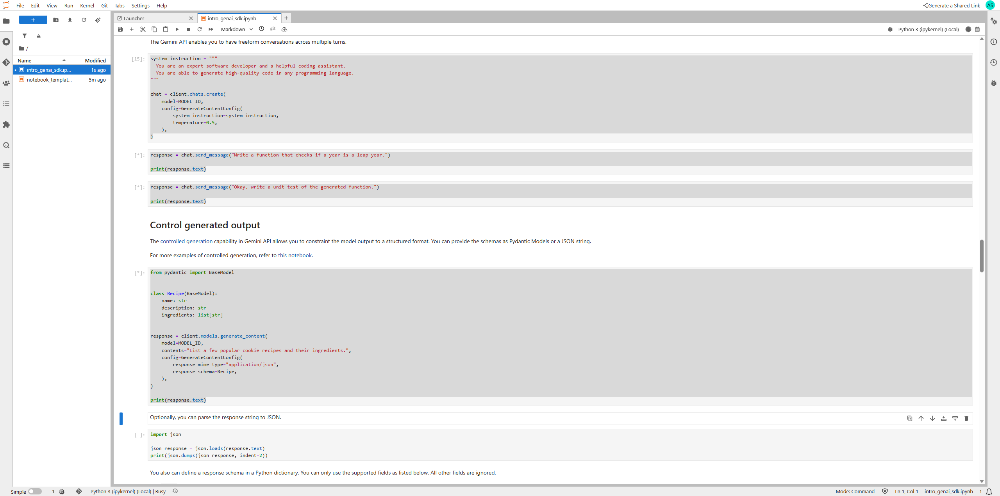
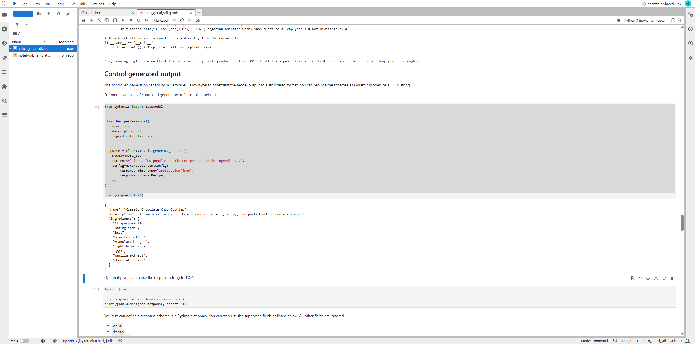

# Session 03 — Getting Started with Google Generative AI Using the Gen AI SDK (GSP1209)

> **Timebox:** 60 minutes • **Level:** Introductory • **Mode:** Self‑paced Lab

---
## 📝 Overview
In this session you will use the **Google Gen AI SDK** to connect to Gemini models from a Jupyter notebook on **Vertex AI Workbench**. You’ll run text and multimodal prompts, add system instructions, tune generation parameters and safety filters, stream outputs, count tokens, and explore advanced features such as function calling, context caching, batch prediction, and text embeddings.

---
## 🎯 Objectives
By the end of this lab, you will be able to:
- Authenticate with the Gen AI SDK in a Vertex AI Workbench notebook.
- Send **text** and **multimodal** prompts to Gemini models.
- Control the model with **system instructions**, **parameters**, and **safety filters**.
- Manage interaction patterns: **streaming**, **async**, **multi‑turn** chat, and **token counting**.
- Use advanced capabilities: **function calling**, **context caching**, **batch prediction**, and **embeddings**.

---
## 🧰 Prerequisites
- Basic Python
- Familiarity with Google Cloud and Vertex AI concepts
- Ability to run notebooks in **Vertex AI Workbench**

> Use the **student credentials** from the lab. Work in an **Incognito** browser session.

---
## 🚀 Step‑by‑Step

### 0) Start Lab & Sign‑in
- Click **Start Lab** to obtain temporary credentials.
- Open Google Cloud Console in **Incognito** and sign in with the provided username/password.
- Accept terms; do **not** enable 2FA, recovery email, or free trials.

### 1) Open the notebook in Vertex AI Workbench
- Console → **Vertex AI** → **Workbench** → open the provided JupyterLab instance.
- Locate and open the lab notebook file.

### 2) Set up the notebook
- Kernel: **Python 3**.
- Run the **Getting started / setup** section to install the Gen AI SDK and import libraries.
- Use **Check my progress** after the setup cell.

### 3) Interact with the model (core usage)
- **Choose a model** (e.g., latest text model).
- **Send text prompts** using the SDK’s `generate_content` methods; extract the text from the response.
- **Send multimodal prompts** (e.g., image + text) using the SDK’s input parts.
- **Set system instructions** to control role, tone, and constraints.

### 4) Configure & control the model (quality & safety)
- Adjust **generation parameters** (temperature, top‑p/top‑k, max tokens).
- Configure **safety filters** to restrict unsafe content categories.
- Start a **multi‑turn chat** and maintain conversation state.
- Constrain outputs with **controlled generation** (schemas / JSON‑like structure).

### 5) Manage the model interaction (patterns)
- Enable **content streaming** and handle incremental chunks.
- Use **asynchronous** request methods for non‑blocking calls.
- **Count tokens** and compute costs or limits before sending prompts.

### 6) Advanced features
- **Function calling**: define tools/functions and let the model choose/produce arguments.
- **Context caching**: cache frequent input context for efficiency across calls.
- **Batch prediction**: send a JSONL file to Cloud Storage / BigQuery, process asynchronously, and retrieve results from an output location.
- **Embeddings**: generate text embeddings and note the output dimensionality.

---
## 🗂 Artifacts to capture (optional screenshots)
-  — Start Lab page
-  — JupyterLab / notebook opened
-  — SDK installed & imports ok
-  — text generation result
-  — parameters & safety filters in code
-  — streamed output example
-  — batch prediction started/completed
-  — embeddings code & vector sample

---
## ✔️ Quality checklist
- [ ] Notebook setup ran successfully (no errors)
- [ ] Text & multimodal prompts executed
- [ ] System instructions affected model behavior as intended
- [ ] Parameters & safety filters tuned and validated
- [ ] Streaming/async or multi‑turn chat demonstrated
- [ ] Optional: batch prediction job finished; output retrieved
- [ ] Optional: embeddings generated

---
## 📝 Session Summary
You used the **Gen AI SDK** from a Vertex AI Workbench notebook to interact with Gemini models. You practiced: sending text and multimodal prompts, shaping behavior via instructions and parameters, enforcing safety, and applying practical interaction patterns (streaming, async, multi‑turn). You also explored advanced capabilities—function calling, context caching, batch prediction, and embeddings—that you can reuse across future labs or production prototypes.

---
## 📎 Reference Files
Add links once available in your repo (relative paths suggested):
- [📄 notebook_template_03.ipynb](../ref/notebook_template_03.ipynb)
- [📄 intro_genai_sdk.ipynb](../ref/intro_genai_sdk.ipynb)

