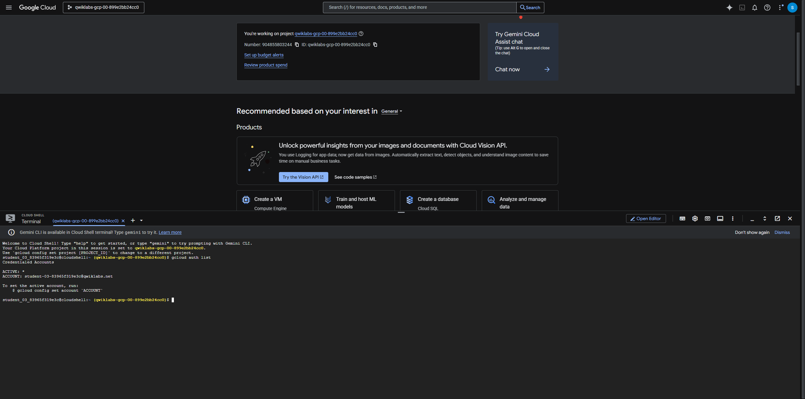
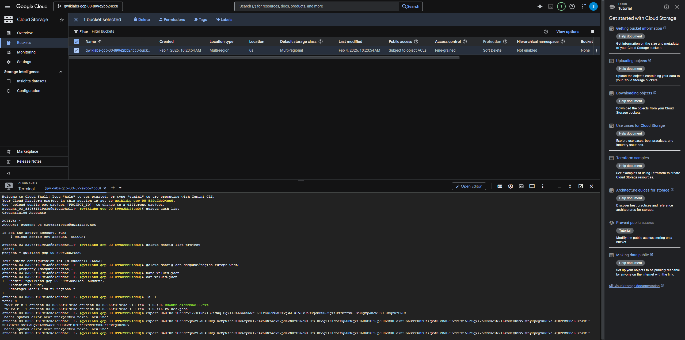
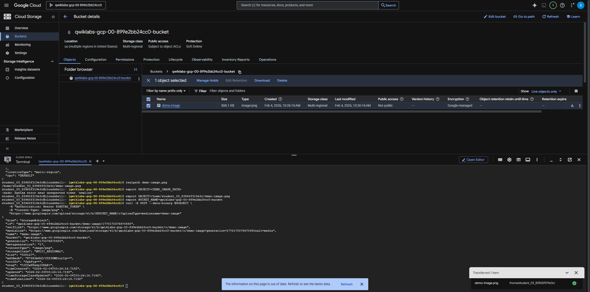

# Session 01 — Introduction to APIs in Google Cloud

> **Goal:** Understand API fundamentals and call the **Cloud Storage JSON/REST API** to create a bucket and upload an object, using OAuth access tokens.

---

## 0) Session Overview
- Learn API basics and Google Cloud's REST endpoints
- Authenticate with **OAuth 2.0** (Application Default Credentials)
- Use **cURL** to call the **Cloud Storage JSON API**
- Create a **bucket** and **upload** a file via API

**Lab overview**  
  

---

## 1) Authenticate & Authorize (OAuth)

**1.1 — Print an access token**
```bash
ACCESS_TOKEN=$(gcloud auth print-access-token)
```

**1.2 — Verify project**
```bash
export PROJECT_ID=$(gcloud config get-value project)
echo $PROJECT_ID
```

> The token is used in the `Authorization: Bearer` header for subsequent API calls.

---

## 2) Create a Cloud Storage bucket via JSON API

**2.1 — Define bucket name**  
(Use your project ID or a globally unique suffix)
```bash
BUCKET_NAME=${PROJECT_ID}-bucket
REGION=US
```

**2.2 — Create bucket (JSON API)**
```bash
curl -s -X POST   -H "Authorization: Bearer $ACCESS_TOKEN"   -H "Content-Type: application/json; charset=UTF-8"   "https://storage.googleapis.com/storage/v1/b?project=${PROJECT_ID}"   -d "{
    "name": "${BUCKET_NAME}",
    "location": "${REGION}",
    "iamConfiguration": {
      "uniformBucketLevelAccess": {
        "enabled": true
      }
    }
  }"
```

**Expected**: a JSON payload containing the new bucket resource (id, name, location, selfLink, timeCreated, etc.).  


---

## 3) Upload a file via JSON API (multipart)

**3.1 — Prepare a sample file**
```bash
echo "hello from json api" > hello.txt
```

**3.2 — Upload object**  
Using **multipart/related** to send metadata + media in one request.
```bash
curl -s -X POST   -H "Authorization: Bearer $ACCESS_TOKEN"   -H "Content-Type: multipart/related; boundary=foo_bar_baz"   "https://storage.googleapis.com/upload/storage/v1/b/${BUCKET_NAME}/o?uploadType=multipart"   --data-binary @- <<'EOF'
--foo_bar_baz
Content-Type: application/json; charset=UTF-8

{"name": "hello.txt"}
--foo_bar_baz
Content-Type: text/plain

$(cat hello.txt)
--foo_bar_baz--
EOF
```

**Expected**: JSON showing the object metadata (bucket, name, size, contentType, md5Hash, timeCreated).  



---

## 4) Verify in Cloud Console
- Open **Cloud Storage → Buckets** → find `${BUCKET_NAME}`
- Confirm `hello.txt` exists in the bucket
- (Optional) Copy the public URL *only if* you’ve configured public access

---

## 5) Troubleshooting
- **403 PERMISSION_DENIED**: ensure your identity has appropriate IAM role (e.g., Storage Admin/Editor) & correct project selected.
- **401 UNAUTHENTICATED**: token expired → re-run `gcloud auth print-access-token`.
- **409 Conflict** on create: bucket name already exists globally → choose a different name.

---

## 6) References (console paths)
- **Cloud Storage buckets**: Navigation menu → **Cloud Storage** → **Buckets**
- **API Explorer**: Available per‑API on the REST docs; use for trial requests

---
