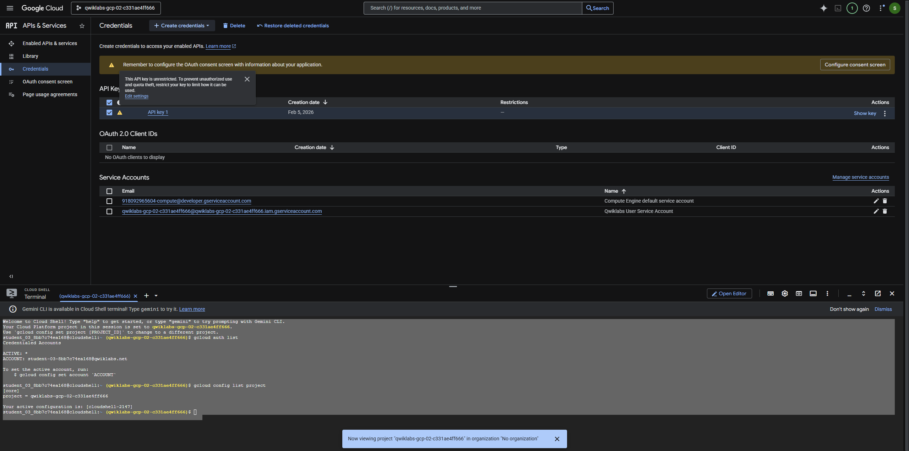
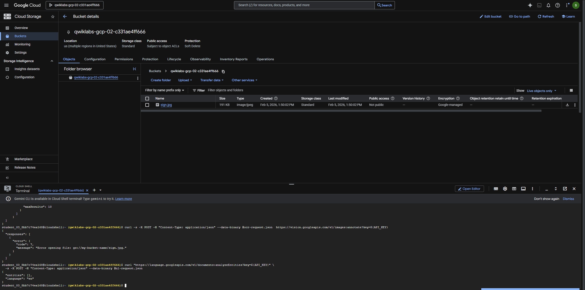

## 🧠 Lab Session (Premium)

**Extract, Analyze, and Translate Text from Images with the Cloud ML APIs**

> Google Cloud Skills Boost – Self‑Paced Lab  
> Level: Intermediate | Duration: ~1 hour

---

## 🎯 Learning Objectives

By the end of this session, you will be able to:

- Enable and use **Cloud Vision API** for OCR (text detection)
- Store and access images from **Cloud Storage**
- Analyze extracted text using **Natural Language API**
- Translate detected text using **Translation API**
- Chain multiple Cloud ML APIs into a simple pipeline

---

## 🧩 Architecture Overview

```
Image (GCS)
   │
   ▼
Cloud Vision API (OCR)
   │
   ├──► Natural Language API (sentiment & syntax)
   │
   └──► Translation API (target language)
```

---

## ✅ Prerequisites

- Active Google Cloud project (provided by lab)
- Cloud Shell access
- Basic understanding of REST & JSON

---

## 🔹 Task 0 – Activate Cloud Shell

1. Open **Cloud Shell** from the Google Cloud Console
2. Authorize when prompted
3. Verify project:
  
  ```bash
  gcloud config get-value project
  ```
  

---

## 🔹 Task 1 – Create an API Key

Cloud ML APIs in this lab use **API Key authentication**.

### Steps

1. Go to **APIs & Services → Credentials**
2. Click **Create Credentials → API key**
3. Copy the generated key


### Set API key as environment variable

```bash
export API_KEY="YOUR_API_KEY"
```

✅ **Checkpoint:** API key created

---

## 🔹 Task 2 – Upload an Image to Cloud Storage

### 1️⃣ Create a bucket

```bash
export BUCKET_NAME="ml-vision-$RANDOM"

gsutil mb gs://$BUCKET_NAME
```

### 2️⃣ Upload the sample image

```bash
gsutil cp sign.jpg gs://$BUCKET_NAME
```


✅ **Checkpoint:** Image uploaded to GCS

---

## 🔹 Task 3 – Create a Cloud Vision API Request

### 1️⃣ Create request JSON

```bash
{
  "requests": [
      {
        "image": {
          "source": {
              "gcsImageUri": "gs://my-bucket-name/sign.jpg"
          }
        },
        "features": [
          {
            "type": "TEXT_DETECTION",
            "maxResults": 10
          }
        ]
      }
  ]
}
```

## 🔹 Task 4 – Extract Detected Text

- In Cloud Shell, call the Cloud Vision API with curl:
```bash
curl -s -X POST -H "Content-Type: application/json" --data-binary @ocr-request.json  https://vision.googleapis.com/v1/images:annotate?key=${API_KEY}
```

- Run the following curl command to save the response to an ocr-response.json file so it can be referenced later
```bash
curl -s -X POST -H "Content-Type: application/json" --data-binary @ocr-request.json  https://vision.googleapis.com/v1/images:annotate?key=${API_KEY} -o ocr-response.json
```

---

## 🔹 Task 5 – Translate Text with Translation API
- First, create a translation-request.json file and add the following to it:
```bash
{
  "q": "your_text_here",
  "target": "en"
}
```
- Run this Bash command in Cloud Shell to extract the image text from the previous step and copy it into a new translation-request.json (all in one command):
```bash
STR=$(jq .responses[0].textAnnotations[0].description ocr-response.json) && STR="${STR//\"}" && sed -i "s|your_text_here|$STR|g" translation-request.json
```
- Now you're ready to call the Translation API. This command will also copy the response into a translation-response.json file:
```bash
curl -s -X POST -H "Content-Type: application/json" --data-binary @translation-request.json https://translation.googleapis.com/language/translate/v2?key=${API_KEY} -o translation-response.json
```
- Run this command to inspect the file with the Translation API response:
```bash
cat translation-response.json
```
- Now you can understand more of what the sign said!

```bash
{
  "data": {
    "translations": [
      {
        "translatedText": "TO THE PUBLIC GOOD the dispatches For Obama, the mustard is from Dijon",
        "detectedSourceLanguage": "fr"
      }
    ]
  }
}
```
In the response:

translatedText contains the resulting translation
detectedSourceLanguage is fr, the ISO language code for French.
The Translation API supports 100+ languages, all of which are listed in the [Language support reference](https://cloud.google.com/translate/docs/languages)
In addition to translating the text from our image, you might want to do more analysis on it. That's where the Natural Language API comes in handy. Onward to the next step!

---

## 🔹 Task 6 – Analyze Text with Natural Language API

```bash
{
  "document":{
    "type":"PLAIN_TEXT",
    "content":"your_text_here"
  },
  "encodingType":"UTF8"
}
```
In the request, you're telling the Natural Language API about the text you're sending:

type: supported type values are PLAIN_TEXT or HTML.

content: pass the text to send to the Natural Language API for analysis. The Natural Language API also supports sending files stored in Cloud Storage for text processing. To send a file from Cloud Storage, replace content with gcsContentUri and use the value of the text file's uri in Cloud Storage.

encodingType: tells the API which type of text encoding to use when processing the text. The API will use this to calculate where specific entities appear in the text.

```bash
STR=$(jq .data.translations[0].translatedText  translation-response.json) && STR="${STR//\"}" && sed -i "s|your_text_here|$STR|g" nl-request.json
```

The nl-request.json file now contains the translated English text from the original image. Time to analyze it!

```bash
curl "https://language.googleapis.com/v1/documents:analyzeEntities?key=${API_KEY}" \
  -s -X POST -H "Content-Type: application/json" --data-binary @nl-request.json
```
- If you scroll through the response you can see the entities the Natural Language API found:
```
{
  "entities": [
    {
      "name": "dispatches",
      "type": "OTHER",
      "metadata": {},
      "salience": 0.3560996,
      "mentions": [
        {
          "text": {
            "content": "dispatches",
            "beginOffset": 23
          },
          "type": "COMMON"
        }
      ]
    },
    {
      "name": "mustard",
      "type": "OTHER",
      "metadata": {},
      "salience": 0.2878307,
      "mentions": [
        {
          "text": {
            "content": "mustard",
            "beginOffset": 38
          },
          "type": "COMMON"
        }
      ]
    },
    {
      "name": "Obama",
      "type": "PERSON",
      "metadata": {
        "mid": "/m/02mjmr",
        "wikipedia_url": "https://en.wikipedia.org/wiki/Barack_Obama"
      },
      "salience": 0.16260329,
      "mentions": [
        {
          "text": {
            "content": "Obama",
            "beginOffset": 31
          },
          "type": "PROPER"
        }
      ]
    },
    {
      "name": "Dijon",
      "type": "LOCATION",
      "metadata": {
        "mid": "/m/0pbhz",
        "wikipedia_url": "https://en.wikipedia.org/wiki/Dijon"
      },
      "salience": 0.08129317,
      "mentions": [
        {
          "text": {
            "content": "Dijon",
            "beginOffset": 54
          },
          "type": "PROPER"
        }
      ]
    }
  ],
  "language": "en"
}
```


## Congratulations!
You've learned how to combine 3 different machine learning APIs: the Vision API's OCR method extracted text from an image, then the Translation API translated that text to English and the Natural Language API to found entities in that text. You can use these APIs together to extract meaning from large datasets of images.

---

## 🧪 Final Assignment

Build an OCR → Translation → NLP pipeline using a new image.

---

> 📌 Optimized for GitHub / Skills Portfolio