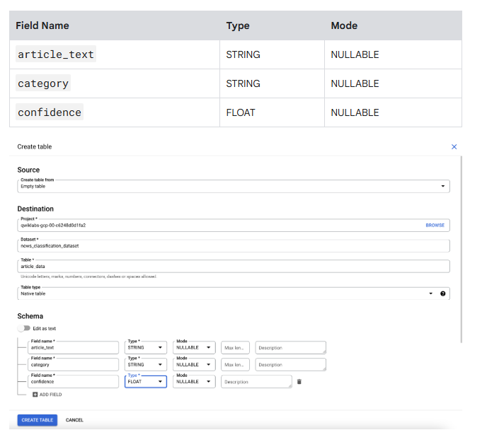

# 🧠 Lab Session (Premium)

**Classify Text into Categories with the Natural Language API**

> Google Cloud Self‑Paced Lab (GSP063)
> Level: Intermediate | Duration: ~1 hour

---

## 🎯 Objectives

- Enable the Cloud Natural Language API
- Classify text documents into content categories
- Process long text inputs
- Store and analyze results in BigQuery

---

## ✅ Prerequisites

- Active Google Cloud Skills Boost lab
- Cloud Shell access

---

## 🔹 Task 0 – Start the Lab & Open Cloud Shell

```bash
gcloud auth list
gcloud config list project
```

---

## 🔹 Task 1 – Enable Cloud Natural Language API

APIs & Services → Library → Cloud Natural Language API → Enable

---

## 🔹 Task 2 – Create an API Key

Since you're using curl to send a request to the Natural Language API, you need to generate an API key to pass in the request URL.

- To create an API key, in your Console, click Navigation menu > APIs & Services > Credentials.

- Then click Create Credentials.

- In the drop down menu, select API key.

Next, copy the key you just generated, then click Close.

Now that you have an API key, you save it as an environment variable to avoid having to insert the value of your API key in each request.

In order to perform next steps please connect to the instance provisioned for you via ssh.

- Open the Navigation menu and select Compute Engine > VM Instances. You should see a provisioned linux-instance.
Click on the SSH button. You are brought to an interactive shell.

In the command line, enter in the following, replacing <YOUR_API_KEY> with the key you just copied:

```bash
export API_KEY=YOUR_API_KEY
```

---

## 🔹 Task 3 – Classify Text

-Create a file named request.json and add the code found below. You can create the file using one of your preferred command line editors (nano, vim, emacs).

```bash
{
  "document":{
    "type":"PLAIN_TEXT",
    "content":"A Smoky Lobster Salad With a Tapa Twist. This spin on the Spanish pulpo a la gallega skips the octopus, but keeps the sea salt, olive oil, pimentón and boiled potatoes."
  }
}
```
- Now you can send this text to the Natural Language API's classifyText method with the following curl command:

```bash
curl "https://language.googleapis.com/v1/documents:classifyText?key=${API_KEY}" \
  -s -X POST -H "Content-Type: application/json" --data-binary @request.json
```
- Run the following command to save the response in a result.json file:
```bash
curl "https://language.googleapis.com/v1/documents:classifyText?key=${API_KEY}" \
  -s -X POST -H "Content-Type: application/json" --data-binary @request.json > result.json
```
The API returned 2 categories for this text:

- /Food & Drink/Cooking & Recipes
- /Food & Drink/Food/Meat & Seafood

The text doesn't explicitly mention that this is a recipe or even that it includes seafood, but the API is able to categorize it. Classifying a single article is cool, but to really see the power of this feature, classify lots of text data.

---

## 🔹 Task 4 – Store Result in BigQuery

- To see the type of text you'll be working with, run the following command to view one article (gsutil provides a command line interface for Cloud Storage):

```bash
bq mk news_dataset
bq mk --table news_dataset.results text:STRING,category:STRING,confidence:FLOAT
```

## 🔹 Task 5. Create a BigQuery table for categorized text data

Before sending the text to the Natural Language API, you need a place to store the text and category for each article.

- Navigate to Navigation menu > BigQuery in the Console.

- Click Done.

- To create a dataset, click on the View actions icon next to your Project ID and select Create dataset:


- The option 'Create dataset' highlighted within the View actions menu.

- Name the dataset news_classification_dataset, then click Create dataset.

- To create a table, click on the View actions icon next to the news_classification_dataset and select Create Table.

- Use the following settings for the new table:

  - Create table from: Empty table
  - Name your table: article_data

- Under Schema, click Add Field and add the following 3 fields:



- Click Create Table.

The table is empty right now. In the next step you'll read the articles from Cloud Storage, send them to the Natural Language API for classification, and store the result in BigQuery.

---

✅ Lab Completed