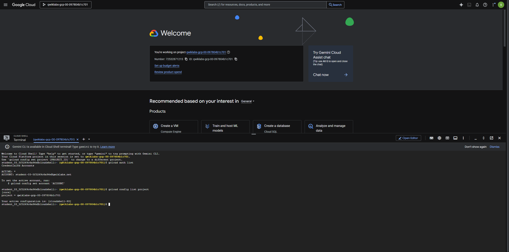
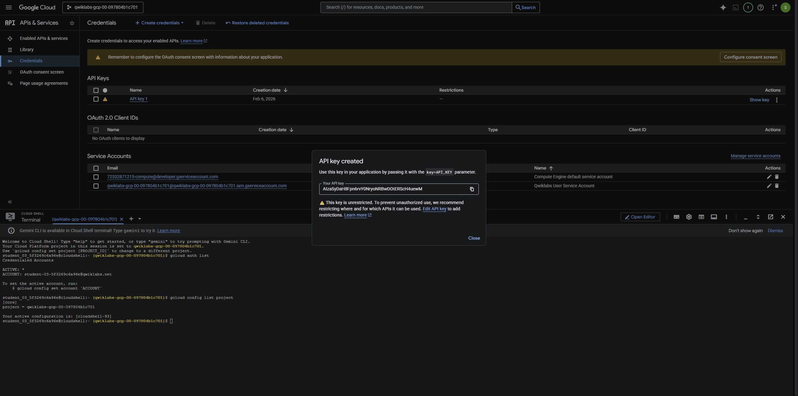
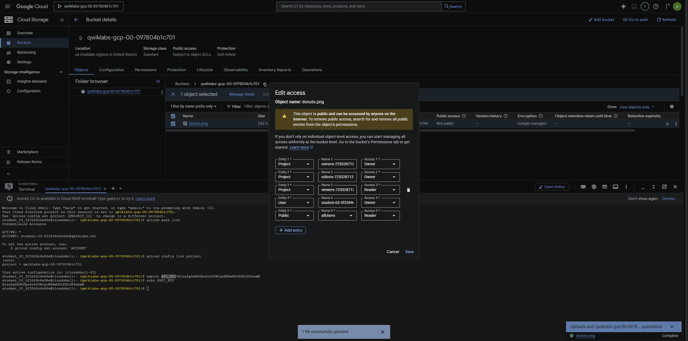
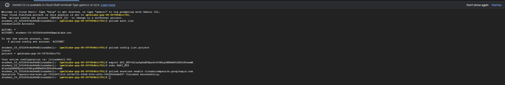
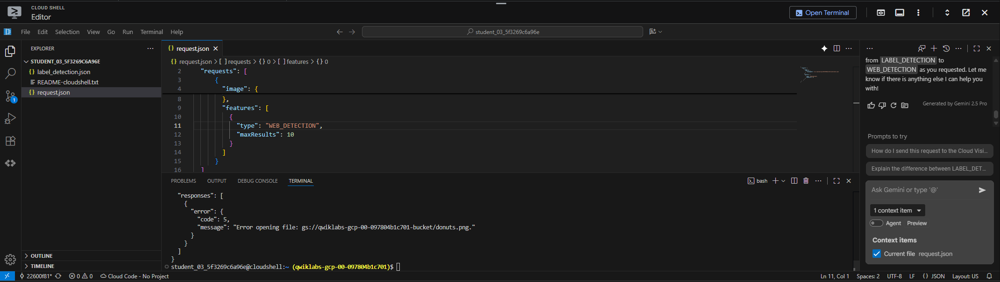
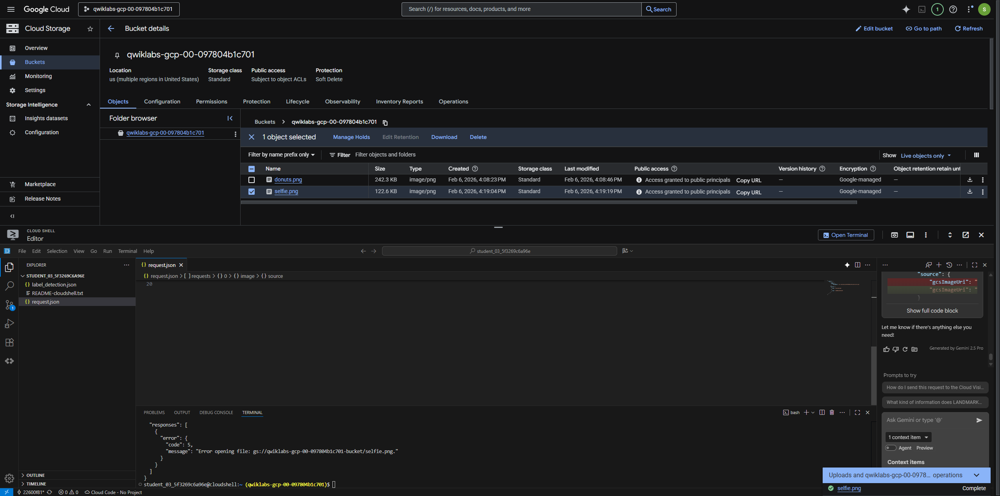

## **Detect Labels, Faces, and Landmarks in Images with the Cloud Vision API**

> Google Cloud Skills Boost – Self‑Paced Lab  
> Level: Intermediate | Duration: ~1 hour

---

## 🎯 Learning Objectives

By completing this session, you will be able to:

- Enable and authenticate access to the **Cloud Vision API**
- Upload images to **Cloud Storage**
- Build Vision API request payloads
- Perform **label detection** on images
- Perform **web detection** on images
- Perform **face detection** using Vision API features
- Perform **landmark annotation** on images
- Perform **object localization** on images
- Interpret and validate Vision API JSON responses

---

## ✅ Prerequisites

- Active Google Cloud Skills Boost lab project
- Access to **Google Cloud Console**
- Cloud Shell enabled
- Basic understanding of REST APIs and JSON

---

## 🔹 Task 0 – Activate Cloud Shell

1. Click **Open Google Cloud Console** from the lab page
2. Click the **Cloud Shell** icon in the top‑right corner
3. Authenticate when prompted
4. Verify your project:

```bash
gcloud config get-value project
```



---

## 🔹 Task 1 – Create an API Key

1. In the Console, navigate to **APIs & Services → Credentials**
2. Click **Create Credentials → API key**
3. Copy the generated API key

Set the API key as an environment variable:

```bash
export API_KEY="YOUR_API_KEY"
```



---

## 🔹 Task 2 – Upload an Image to a Cloud Storage Bucket

### 1️⃣ Create a Cloud Storage bucket

```bash
export BUCKET_NAME="vision-lab-$RANDOM"

gsutil mb gs://$BUCKET_NAME
```

### 2️⃣ Upload an image

```bash
gsutil cp image.jpg gs://$BUCKET_NAME
```

### 3️⃣ Make the image publicly accessible (lab requirement)

```bash
gsutil acl ch -u AllUsers:R gs://$BUCKET_NAME/image.jpg
```



---

## 🔹 Task 3 – Create the Vision API Request

Create a request file that references the image in Cloud Storage:

```bash
cat > request.json <<EOF
{
  "requests": [
      {
        "image": {
          "source": {
              "gcsImageUri": "gs://PROJECT_ID-bucket/donuts.png"
          }
        },
        "features": [
          {
            "type": "LABEL_DETECTION",
            "maxResults": 10
          }
        ]
      }
  ]
}
EOF
```

- Enable Gemini Code Assist in the Cloud Shell IDE
1. In Cloud Shell, enable the Gemini for Google Cloud API with the following command:
`gcloud services enable cloudaicompanion.googleapis.com`
2. Click Open Editor on the Cloud Shell toolbar.
3. Click Cloud Code - No Project in the status bar at the bottom of the screen.
4. Authorize the plugin if necessary. If a project is not automatically selected, click Select a Google Cloud Project, and choose Project ID.
5. Verify that your Google Cloud project (Project ID) displays in the Cloud Code status message in the status bar.



---

## 🔹 Task 4 – Perform Label Detection

The first Cloud Vision API feature you explore, is label detection. The method you use returns a list of labels (words) of what's in your image.
1. In the Cloud Shell terminal, run the following curl command to call the Cloud Vision API and save the response in label_detection.json file:

```bash
curl -s -X POST -H "Content-Type: application/json" --data-binary @request.json  https://vision.googleapis.com/v1/images:annotate?key=${API_KEY} -o label_detection.json && cat label_detection.json
```
The API was able to identify the specific type of donuts these are, powdered sugar. Cool! For each label the Vision API found, it returns a:

  `description with the name of the item.
  score, a number from 0 - 1 indicating how confident it is that the description matches what's in the image.
  mid value that maps to the item's mid in Google's Knowledge Graph. You can use the mid when calling the Knowledge Graph API to get more information on the item.`

2. In the Cloud Shell Editor, navigate to label_detection.json. This action enables Gemini Code Assist, as indicated by the presence of the Gemini Code Assist: Smart Actions icon in the upper-right corner of the editor.
3. Click the Gemini Code Assist: Smart Actions Gemini Code Assist: Smart Actions icon and select Explain this.
4. Gemini Code Assist opens a chat pane with the prefilled prompt of Explain this. In the inline text box of the Code Assist chat, replace the prefilled prompt with the following, and click Send:
```
You are a Machine Learning Engineer at Cymbal AI. A new team member needs help understanding this Cloud Vision API response. Explain the label_detection.json file in detail. Break down its key components and their function within the JSON code.

For the suggested improvements, don't make any changes to the file's content.
```


---

## 🔹 Task 5 – Perform Web Detection

In addition to getting labels on what's in your image, the Cloud Vision API can also search the internet for additional details on your image. Through the API's WebDetection method, you get a lot of interesting data back:

- A list of entities found in your image, based on content from pages with similar images.
- URLs of exact and partial matching images found across the web, along with the URLs of those pages.
- URLs of similar images, like doing a reverse image search.

To try out web detection, use the same image of beignets and change one line in the request.json file (you can also venture out into the unknown and use an entirely different image).

1. In the Cloud Shell Editor, still in the same directory, navigate to and open request.json.
2. Click the Gemini Code Assist: Smart Actions Gemini Code Assist icon on the toolbar.
3. To edit the request.json file, paste the following prompt into the Gemini Code Assist inline text field that opens from the toolbar.
```
In the request.json file, update the features list, change type from LABEL_DETECTION to WEB_DETECTION.
```
4. To prompt Gemini Code Assist to modify the code accordingly, press ENTER.
5. When prompted in the Gemini Diff view, click Apply all changes
6. In the Cloud Shell terminal, run the following curl command to call the Cloud Vision API:
```
curl -s -X POST -H "Content-Type: application/json" --data-binary @request.json  https://vision.googleapis.com/v1/images:annotate?key=${API_KEY}
```
7. Dive into the response, starting with webEntities. Here are some of the entities this image returned:



---

## 🔹 Task 6 – Perform Face Detection
Next explore the face detection methods of the Vision API.

The face detection method returns data on faces found in an image, including the emotions of the faces and their location in the image.

Upload a new image
To use this method, you upload a new image with faces to the Cloud Storage bucket.

1. Right-click on the following image, then click Save image as, and save it to your computer as selfie.png.
2. Now upload it to your Cloud Storage bucket the same way you did before, and make it public.

- Update the request file
1. In the Cloud Shell Editor, still in the same directory, navigate to request.json.

2. Click the Gemini Code Assist: Smart Actions Gemini Code Assist icon on the toolbar.

3. To assist with updating your request.json file, paste the following prompt into the Gemini Code Assist inline text field that opens from the toolbar.
```
Update the JSON file request.json to achieve three specific changes:

* Update the gcsImageUri value from donuts.png to selfie.png.
* Replace the existing features array with two new feature types: FACE_DETECTION and LANDMARK_DETECTION.
* Don't want maxResults result.
```
4. To prompt Gemini Code Assist to modify the code accordingly, press ENTER.
5. When prompted in the Gemini Diff view, click Apply all changes.

- Call the Vision API and parse the response
1. In the Cloud Shell terminal, run the following curl command to call the Cloud Vision API:
```
curl -s -X POST -H "Content-Type: application/json" --data-binary @request.json  https://vision.googleapis.com/v1/images:annotate?key=${API_KEY}
```
2. Take a look at the faceAnnotations object in the response. Notice that the API returns an object for each face found in the image—in this case, three. Here's a clipped version of the response:



## 🔹 Task 7 – Perform Landmark Annotation

Landmark detection can identify common (and obscure) landmarks. It returns the name of the landmark, its latitude and longitude coordinates, and the location of where the landmark was identified in an image.

To use this method, you upload a new image to the Cloud Storage bucket.
1. Right-click on the following image, then click Save image as, and save it to your computer as city.png.
  _Citation: Saint Basil's Cathedral, Moscow, Russia (December 19, 2019) by Adrien Wodey on Unsplash, the free media repository. Retrieved from https://unsplash.com/photos/multicolored-dome-temple-yjyWCNx0J1U. This file is licensed under the Unsplash license._
2. Now upload it to your Cloud Storage bucket the same way you did before, and make it public.

Next, update your request.json file with the following, which includes the URL of the new image, and uses landmark detection:
```
{
  "requests": [
      {
        "image": {
          "source": {
              "gcsImageUri": "gs://PROJECT_ID-bucket/city.png"
          }
        },
        "features": [
          {
            "type": "LANDMARK_DETECTION",
            "maxResults": 10
          }
        ]
      }
  ]
}
```
- Call the Vision API and parse the response
1. In the Cloud Shell terminal, run the following curl command to call the Cloud Vision API:
```
curl -s -X POST -H "Content-Type: application/json" --data-binary @request.json  https://vision.googleapis.com/v1/images:annotate?key=${API_KEY}
```
2. Look at the landmarkAnnotations part of the response:


---

## 🔹 Task 8 – Perform Object Localization

The Vision API can detect and extract multiple objects in an image with Object Localization. Object localization identifies multiple objects in an image and provides a LocalizedObjectAnnotation for each object in the image. Each LocalizedObjectAnnotation identifies information about the object, the position of the object, and rectangular bounds for the region of the image that contains the object.

Object localization identifies both significant and less-prominent objects in an image.

Object information is returned in English only. Cloud Translation can translate English labels into various other languages.

- Update your request.json file with the following, which includes the URL of the new image, and uses object localization.
```
{
  "requests": [
    {
      "image": {
        "source": {
          "imageUri": "https://cloud.google.com/vision/docs/images/bicycle_example.png"
        }
      },
      "features": [
        {
          "maxResults": 10,
          "type": "OBJECT_LOCALIZATION"
        }
      ]
    }
  ]
}
```
- Call the Vision API and parse the response
1. In the Cloud Shell terminal, run the following curl command to call the Cloud Vision API:
```
curl -s -X POST -H "Content-Type: application/json" --data-binary @request.json  https://vision.googleapis.com/v1/images:annotate?key=${API_KEY}
```
2. Next, look at the localizedObjectAnnotations part of the response:

---

## 🔹 Task 9. Explore other Vision API methods
You've looked at the Vision API's label, face, landmark detection and object localization methods, but there are three others you haven't explored. Dive into the Method: images.annotate documentation to learn about the other three:

- Logo detection: Identify common logos and their location in an image.
- Safe search detection: Determine whether or not an image contains explicit content. This is useful for any application with user-generated content. You can filter images based on four factors: adult, medical, violent, and spoof content.
- Text detection: Run OCR to extract text from images. This method can even identify the language of text present in an image.

## 🧪 Final Validation Checklist

- [x] API key created
- [x] Images uploaded to Cloud Storage
- [x] Label detection completed
- [x] Web detection completed
- [x] Face detection completed
- [x] Landmark annotation completed
- [x] Object localization completed

---

🎉 **Congratulations! You have successfully completed the Cloud Vision API image analysis session.**

---
