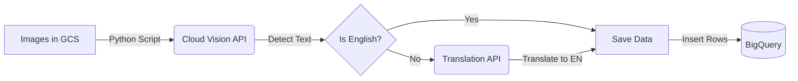

🏆 Challenge Lab: Use Machine Learning APIs on Google Cloud

> **Google Cloud Skills Boost** – Challenge Lab (GSP329)  
> **Level**: Intermediate | **Duration**: ~1.5 hours

---

## 🎯 Learning Objectives

In this challenge, you will demonstrate your ability to:
- Configure a **Service Account** with precise IAM permissions.
- authentication using **Service Account Credentials (JSON)**.
- Use the **Vision API** to extract text from images.
- Use the **Translation API** to translate non-English text.
- Process data using a **Python** script and upload results to **BigQuery**.
- Analyze the dataset using **SQL**.

---

## 🧩 Architecture Overview



---

## ✅ Prerequisites

1. **Start the Lab** and wait for the provisioned environment.
2. Open **Cloud Shell**.
3. Set your Project ID variable:

```bash
export PROJECT_ID=$(gcloud config get-value project)

```

---

## 🔹 Task 1: Configure a Service Account

We need to create a service account and grant it specific roles to access BigQuery and Cloud Storage.

> **⚠️ Crucial Note:** This lab requires specific IAM roles. Unlike standard labs, using `admin` roles might fail the check. We also need `serviceUsageConsumer` to avoid API permission errors.

Run the following commands in Cloud Shell:

```bash
# 1. Create the Service Account
gcloud iam service-accounts create my-challenge-sa --display-name "Challenge SA"

# 2. Grant BigQuery Data Editor Role
gcloud projects add-iam-policy-binding $PROJECT_ID \
    --member serviceAccount:my-challenge-sa@$PROJECT_ID.iam.gserviceaccount.com \
    --role roles/bigquery.dataEditor

# 3. Grant Storage Object Admin Role
gcloud projects add-iam-policy-binding $PROJECT_ID \
    --member serviceAccount:my-challenge-sa@$PROJECT_ID.iam.gserviceaccount.com \
    --role roles/storage.objectAdmin

# 4. Grant Service Usage Consumer (Required for API calls via Python)
gcloud projects add-iam-policy-binding $PROJECT_ID \
    --member serviceAccount:my-challenge-sa@$PROJECT_ID.iam.gserviceaccount.com \
    --role roles/serviceusage.serviceUsageConsumer

```

---

## 🔹 Task 2: Create and Download Credential File

Generate the JSON key for authentication and set it as an environment variable so the Python script can use it automatically.

```bash
# 1. Create and download the key.json file
gcloud iam service-accounts keys create key.json \
    --iam-account=my-challenge-sa@$PROJECT_ID.iam.gserviceaccount.com

# 2. Export the credential path
export GOOGLE_APPLICATION_CREDENTIALS=${PWD}/key.json

```

✅ **Checkpoint:** Click *Check my progress* for Task 1 & 2.

---

## 🔹 Task 3 & 4: Modify Python Script (Vision & Translation)

The lab provides an incomplete script (`analyze-images-v2.py`). We need to add logic to:

1. Detect text using **Vision API**.
2. Translate text using **Translate API** (if locale is not 'en').
3. Send data to **BigQuery**.

### 📥 Solution Script

Run this block to create the **final working script** directly in your Cloud Shell:

```python
cat > analyze_images_v2.py <<EOF
import os
import sys

# Import Google Cloud Library modules
from google.cloud import storage, bigquery, language, vision, translate_v2

if ('GOOGLE_APPLICATION_CREDENTIALS' in os.environ):
    if (not os.path.exists(os.environ['GOOGLE_APPLICATION_CREDENTIALS'])):
        print ("The GOOGLE_APPLICATION_CREDENTIALS file does not exist.\n")
        exit()
else:
    print ("The GOOGLE_APPLICATION_CREDENTIALS environment variable is not defined.\n")
    exit()

if len(sys.argv)<3:
    print('You must provide parameters for the Google Cloud project ID and Storage bucket')
    print ('python3 '+sys.argv[0]+ '[PROJECT_NAME] [BUCKET_NAME]')
    exit()

project_name = sys.argv[1]
bucket_name = sys.argv[2]

# Set up our GCS, BigQuery, and Natural Language clients
storage_client = storage.Client()
bq_client = bigquery.Client(project=project_name)
nl_client = language.LanguageServiceClient()

# Set up client objects for the vision and translate_v2 API Libraries
vision_client = vision.ImageAnnotatorClient()
translate_client = translate_v2.Client()

# Setup the BigQuery dataset and table objects
dataset_ref = bq_client.dataset('image_classification_dataset')
dataset = bigquery.Dataset(dataset_ref)
table_ref = dataset.table('image_text_detail')
table = bq_client.get_table(table_ref)

# Create an array to store results data to be inserted into the BigQuery table
rows_for_bq = []

# Get a list of the files in the Cloud Storage Bucket
files = storage_client.bucket(bucket_name).list_blobs()
bucket = storage_client.bucket(bucket_name)

print('Processing image files from GCS. This will take a few minutes..')

# Process files from Cloud Storage and save the result to send to BigQuery
for file in files:
    if file.name.endswith('jpg') or  file.name.endswith('png'):
        file_content = file.download_as_bytes()

        # TBD: Create a Vision API image object called image_object
        image = vision.Image(content=file_content)

        # TBD: Detect text in the image and save the response data into an object called response
        response = vision_client.text_detection(image=image)

        # Save the text content found by the vision API into a variable called text_data
        text_data = response.text_annotations[0].description

        # Save the text detection response data in <filename>.txt to cloud storage
        file_name = file.name.split('.')[0] + '.txt'
        blob = bucket.blob(file_name)
        # Upload the contents of the text_data string variable to the Cloud Storage file
        blob.upload_from_string(text_data, content_type='text/plain')

        # Extract the description and locale data from the response file
        desc = response.text_annotations[0].description
        locale = response.text_annotations[0].locale

        # TBD: Save the description as the translated text into target_language
        if locale == 'en':
            translated_text = desc
        else:
            # TBD: According to the target language pass the description data to the translation API
            translation = translate_client.translate(desc, target_language='en')
            translated_text = translation['translatedText']
        
        print(translated_text)

        # if there is response data save the original text read from the image,
        # the locale, translated text, and filename
        if len(response.text_annotations) > 0:
            rows_for_bq.append((desc, locale, translated_text, file.name))

print('Writing Vision API image data to BigQuery...')
# Write original text, locale and translated text to BQ
# TBD: When the script is working uncomment the next line to upload results to BigQuery
errors = bq_client.insert_rows(table, rows_for_bq)
assert errors == []
EOF

```

### 🚀 Execute the Script

Run the python script with your Project ID as the argument (for both Project and Bucket name):

```bash
python3 analyze_images_v2.py $PROJECT_ID $PROJECT_ID

```

*Wait for the script to finish processing all images until you see "Writing Vision API image data to BigQuery..."*

✅ **Checkpoint:** Click *Check my progress* for Task 3 & 4.

---

## 🔹 Task 5: Identify the Most Common Language

Once the data is in BigQuery, you must analyze it to find the most frequent language locale.

1. In the Google Cloud Console, navigate to **BigQuery**.
2. Open a **New Query** tab.
3. Run the following SQL:

```sql
SELECT
    locale,
    COUNT(locale) as lcount
FROM
    `image_classification_dataset.image_text_detail`
GROUP BY
    locale
ORDER BY
    lcount DESC

```

✅ **Checkpoint:** Click *Check my progress* for Task 5.

---

## 🧪 Final Validation Checklist

* [x] Service Account created with `dataEditor` & `objectAdmin` roles.
* [x] API Key (JSON) downloaded and exported.
* [x] Python script analyzes images via Vision API.
* [x] Non-English text translated via Translation API.
* [x] Data successfully uploaded to BigQuery.
* [x] SQL Query executed to count locales.

---

🎉 **Congratulations! You have successfully completed the Machine Learning APIs Challenge Lab.**
